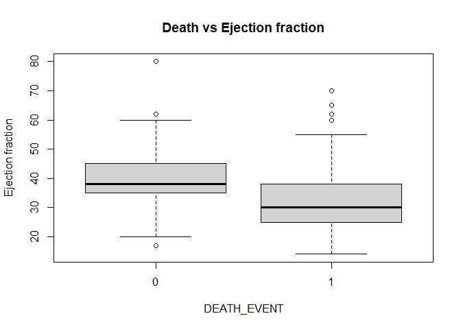

Survival of patients with heart failure
================

**Source of data:** UCI machine learning
repository:<https://archive.ics.uci.edu/dataset/519/heart+failure+clinical+records>

**Upload date of data:** 2nd April 2020

**Owner of the data:** The original dataset version was collected by
Tanvir Ahmad, Assia Munir, Sajjad Haider Bhatti, Muhammad Aftab, and
Muhammad Ali Raza in 2015. Current dataset has slight difference from
original dataset in terms of names of columns which was done by D.
Chicco and Giuseppe Jurman in their article published on BMC Medical
Informatics and Decision Making.
Link:<https://bmcmedinformdecismak.biomedcentral.com/articles/10.1186/s12911-020-1023-5#article-info>

**Objective of data collection:** Dataset was collected for analyzing
the survival pattern of heart failure patients who were admitted to
Institute of Cardiology and Allied hospital Faisalabad-Pakistan during
April-December (2015). And also rank the features which corresponds to
the most important risk factors.

**Analysis of data by other researchers:** D.Chicco and Giuseppe Jurman
found in their analysis that serum creatinine and ejection fraction
plays a very important role in understanding if a patient will survive
after heart failure or not.This discovery has the potential to impact on
clinical practice, becoming a new supporting tool for physicians when
predicting if a heart failure patient will survive or not.

**Description of data set:** This dataset was collected during
April–December 2015.It contains the medical records of 299 heart failure
patients collected at the Faisalabad Institute of Cardiology and at the
Allied Hospital in Faisalabad (Punjab, Pakistan). The patients consisted
of 105 women and 194 men, and their ages range between 40 and 95 years
old. All 299 patients had left ventricular systolic dysfunction and had
previous heart failures that put them in classes III or IV of New York
Heart Association (NYHA) classification of the stages of heart failure.
The dataset contains 13 features, which report clinical, body, and
lifestyle information.

**Description of columns:**

``` r
column_des<-read.csv("C:/Users/rajsh/OneDrive/Documents/Rproject/Book1.csv")
print(column_des)
```

    ##                          Feature
    ## 1                            Age
    ## 2                        Anaemia
    ## 3            High blood pressure
    ## 4  Creatinine phosphokinase(CPK)
    ## 5                       Diabetes
    ## 6              Ejection fraction
    ## 7                            Sex
    ## 8                      Platelets
    ## 9               Serum creatinine
    ## 10                  Serum sodium
    ## 11                       Smoking
    ## 12                          Time
    ## 13          (target) death event
    ##                                                  Explanation      Measurement
    ## 1                                         Age of the patient            Years
    ## 2                  Decrease of red blood cells or hemoglobin          Boolean
    ## 3                              If a patient has hypertension          Boolean
    ## 4                       Level of the CPK enzyme in the blood            mcg/L
    ## 5                                If the patient has diabetes          Boolean
    ## 6  Percentage of blood leaving the heart at each contraction       Percentage
    ## 7                                               Woman or man           Binary
    ## 8                                     Platelets in the blood kiloplatelets/mL
    ## 9                           Level of creatinine in the blood            mg/dL
    ## 10                              Level of sodium in the blood            mEq/L
    ## 11                                     If the patient smokes          Boolean
    ## 12                                          Follow-up period             Days
    ## 13           If the patient died during the follow-up period          Boolean
    ##                  Range
    ## 1         [40,..., 95]
    ## 2                 0, 1
    ## 3                 0, 1
    ## 4       [23,..., 7861]
    ## 5                 0, 1
    ## 6         [14,..., 80]
    ## 7                 0, 1
    ## 8  [25.01,..., 850.00]
    ## 9     [0.50,..., 9.40]
    ## 10      [114,..., 148]
    ## 11                0, 1
    ## 12         [4,...,285]
    ## 13                0, 1

The hospital physician considered a patient having **anaemia** if
haematocrit levels were lower than 36%.<br> The **creatinine
phosphokinase (CPK)** states the level of the CPK enzyme in blood. When
a muscle tissue gets damaged, CPK flows into the blood. Therefore, high
levels of CPK in the blood of a patient might indicate a heart failure
or injury.It is measured in microgram per litre (mcg/L).<br> The
**ejection fraction** states the percentage of how much blood the left
ventricle pumps out with each contraction.<br> The **serum creatinine**
is a waste product generated by creatine, when a muscle breaks
down.Doctors focus on serum creatinine in blood to check kidney
function. If a patient has high levels of serum creatinine, it may
indicate renal dysfunction.A normal range for serum creatinine is
approximately 0.6 to 1.3 milligrams per deciliter (mg/dL) for adult
males and 0.5 to 1.2 mg/dL for adult females.<br> The **serum sodium
test** is a routine blood exam that indicates if a patient has normal
levels of sodium in the blood. An abnormally low level of sodium(\<125
mEq/L) in the blood might be caused by heart failure.mEq/L represents
milliequivalents per liter.<br> The **death event** feature, that we use
as the target in our binary classification study, states if the patient
died or survived before the end of the follow-up period, that was 130
days on average.<br>

## **Purpose of my project:**Carrying out EDA to look for important factors for predicting survival of patients from heart failure.

``` r
#loading necessary libraries
library(ggplot2)
library(dplyr)
```

    ## 
    ## Attaching package: 'dplyr'

    ## The following objects are masked from 'package:stats':
    ## 
    ##     filter, lag

    ## The following objects are masked from 'package:base':
    ## 
    ##     intersect, setdiff, setequal, union

``` r
library(moments)
```

``` r
#Loading dataset 
df<-read.csv("C:/Users/rajsh/OneDrive/Documents/Rproject/heart_failure_clinical_records_dataset.csv")
head(df)
```

    ##   age anaemia creatinine_phosphokinase diabetes ejection_fraction
    ## 1  75       0                      582        0                20
    ## 2  55       0                     7861        0                38
    ## 3  65       0                      146        0                20
    ## 4  50       1                      111        0                20
    ## 5  65       1                      160        1                20
    ## 6  90       1                       47        0                40
    ##   high_blood_pressure platelets serum_creatinine serum_sodium sex smoking time
    ## 1                   1   265.000              1.9          130   1       0    4
    ## 2                   0   263.358              1.1          136   1       0    6
    ## 3                   0   162.000              1.3          129   1       1    7
    ## 4                   0   210.000              1.9          137   1       0    7
    ## 5                   0   327.000              2.7          116   0       0    8
    ## 6                   1   204.000              2.1          132   1       1    8
    ##   DEATH_EVENT
    ## 1           1
    ## 2           1
    ## 3           1
    ## 4           1
    ## 5           1
    ## 6           1

``` r
#Structure of data
cat("Shape of the dataset is:",dim(df),"\n")
```

    ## Shape of the dataset is: 299 13

``` r
str(df)
```

    ## 'data.frame':    299 obs. of  13 variables:
    ##  $ age                     : num  75 55 65 50 65 90 75 60 65 80 ...
    ##  $ anaemia                 : int  0 0 0 1 1 1 1 1 0 1 ...
    ##  $ creatinine_phosphokinase: int  582 7861 146 111 160 47 246 315 157 123 ...
    ##  $ diabetes                : int  0 0 0 0 1 0 0 1 0 0 ...
    ##  $ ejection_fraction       : int  20 38 20 20 20 40 15 60 65 35 ...
    ##  $ high_blood_pressure     : int  1 0 0 0 0 1 0 0 0 1 ...
    ##  $ platelets               : num  265 263 162 210 327 ...
    ##  $ serum_creatinine        : num  1.9 1.1 1.3 1.9 2.7 2.1 1.2 1.1 1.5 9.4 ...
    ##  $ serum_sodium            : int  130 136 129 137 116 132 137 131 138 133 ...
    ##  $ sex                     : int  1 1 1 1 0 1 1 1 0 1 ...
    ##  $ smoking                 : int  0 0 1 0 0 1 0 1 0 1 ...
    ##  $ time                    : int  4 6 7 7 8 8 10 10 10 10 ...
    ##  $ DEATH_EVENT             : int  1 1 1 1 1 1 1 1 1 1 ...

Since age is measured in years and platelets are count so they are
integer columns, thus converting them into integer. By description of
dataset we know that anaemia,high blood pressure,diabetes,sex and
smoking are categorical columns which are encoded with 0 and 1.

``` r
df$age <- as.integer(df$age)
str(df)
```

    ## 'data.frame':    299 obs. of  13 variables:
    ##  $ age                     : int  75 55 65 50 65 90 75 60 65 80 ...
    ##  $ anaemia                 : int  0 0 0 1 1 1 1 1 0 1 ...
    ##  $ creatinine_phosphokinase: int  582 7861 146 111 160 47 246 315 157 123 ...
    ##  $ diabetes                : int  0 0 0 0 1 0 0 1 0 0 ...
    ##  $ ejection_fraction       : int  20 38 20 20 20 40 15 60 65 35 ...
    ##  $ high_blood_pressure     : int  1 0 0 0 0 1 0 0 0 1 ...
    ##  $ platelets               : num  265 263 162 210 327 ...
    ##  $ serum_creatinine        : num  1.9 1.1 1.3 1.9 2.7 2.1 1.2 1.1 1.5 9.4 ...
    ##  $ serum_sodium            : int  130 136 129 137 116 132 137 131 138 133 ...
    ##  $ sex                     : int  1 1 1 1 0 1 1 1 0 1 ...
    ##  $ smoking                 : int  0 0 1 0 0 1 0 1 0 1 ...
    ##  $ time                    : int  4 6 7 7 8 8 10 10 10 10 ...
    ##  $ DEATH_EVENT             : int  1 1 1 1 1 1 1 1 1 1 ...

``` r
#Getting basic descriptive statistic summary of categorical columns
#For Anaemia
Anaemia_df <- data.frame(
  Anaemia = c("Present", "Absent"),
  Full_sampleNumber = c(sum(df$anaemia), 299 - sum(df$anaemia)),
  Full_samplePercentage = c(sum(df$anaemia) * 100 / nrow(df), (299 - sum(df$anaemia)) * 100 / nrow(df)),
  Dead_patientsNumber = c(sum(df[df$DEATH_EVENT == 1, ]$anaemia),sum(df$DEATH_EVENT)-sum(df[df$DEATH_EVENT == 1, ]$anaemia)),
  Dead_patientsPercentage = c(sum(df[df$DEATH_EVENT == 1, ]$anaemia) * 100 /sum(df$DEATH_EVENT), (sum(df$DEATH_EVENT)- sum(df[df$DEATH_EVENT == 1, ]$anaemia)) * 100 /sum(df$DEATH_EVENT)) ,
  Survived_patientsNumber = c(sum(df[df$DEATH_EVENT == 0, ]$anaemia), ((299-sum(df$DEATH_EVENT)) - sum(df[df$DEATH_EVENT == 0, ]$anaemia))),
  Survived_patientsPercentage = c(sum(df[df$DEATH_EVENT == 0, ]$anaemia) * 100 /(299-sum(df$DEATH_EVENT)) , ((299-sum(df$DEATH_EVENT)) - sum(df[df$DEATH_EVENT == 0, ]$anaemia)) * 100 / (299-sum(df$DEATH_EVENT)))
)
print(Anaemia_df)
```

    ##   Anaemia Full_sampleNumber Full_samplePercentage Dead_patientsNumber
    ## 1 Present               129              43.14381                  46
    ## 2  Absent               170              56.85619                  50
    ##   Dead_patientsPercentage Survived_patientsNumber Survived_patientsPercentage
    ## 1                47.91667                      83                     40.8867
    ## 2                52.08333                     120                     59.1133

``` r
#For High blood pressure
High_blood_pressure_df <- data.frame(
  High_blood_pressure = c("Present", "Absent"),
  Full_sampleNumber = c(sum(df$high_blood_pressure), 299 - sum(df$high_blood_pressure)),
  Full_samplePercentage = c(sum(df$high_blood_pressure) * 100 / nrow(df), (299 - sum(df$high_blood_pressure)) * 100 / nrow(df)),
  Dead_patientsNumber = c(sum(df[df$DEATH_EVENT == 1, ]$high_blood_pressure), sum(df$DEATH_EVENT) - sum(df[df$DEATH_EVENT == 1, ]$high_blood_pressure)),
  Dead_patientsPercentage = c(sum(df[df$DEATH_EVENT == 1, ]$high_blood_pressure) * 100 / sum(df$DEATH_EVENT), (sum(df$DEATH_EVENT) - sum(df[df$DEATH_EVENT == 1, ]$high_blood_pressure)) * 100 / sum(df$DEATH_EVENT)),
  Survived_patientsNumber = c(sum(df[df$DEATH_EVENT == 0, ]$high_blood_pressure), (299 - sum(df$DEATH_EVENT)) - sum(df[df$DEATH_EVENT == 0, ]$high_blood_pressure)),
  Survived_patientsPercentage = c(sum(df[df$DEATH_EVENT == 0, ]$high_blood_pressure) * 100 / (299 - sum(df$DEATH_EVENT)), ((299 - sum(df$DEATH_EVENT)) - sum(df[df$DEATH_EVENT == 0, ]$high_blood_pressure)) * 100 / (299 - sum(df$DEATH_EVENT)))
)
print(High_blood_pressure_df)
```

    ##   High_blood_pressure Full_sampleNumber Full_samplePercentage
    ## 1             Present               105              35.11706
    ## 2              Absent               194              64.88294
    ##   Dead_patientsNumber Dead_patientsPercentage Survived_patientsNumber
    ## 1                  39                  40.625                      66
    ## 2                  57                  59.375                     137
    ##   Survived_patientsPercentage
    ## 1                    32.51232
    ## 2                    67.48768

``` r
# For Diabetes
Diabetes_df <- data.frame(
  Diabetes = c("Present", "Absent"),
  Full_sampleNumber = c(sum(df$diabetes), 299 - sum(df$diabetes)),
  Full_samplePercentage = c(sum(df$diabetes) * 100 / nrow(df), (299 - sum(df$diabetes)) * 100 / nrow(df)),
  Dead_patientsNumber = c(sum(df[df$DEATH_EVENT == 1, ]$diabetes), sum(df$DEATH_EVENT) - sum(df[df$DEATH_EVENT == 1, ]$diabetes)),
  Dead_patientsPercentage = c(sum(df[df$DEATH_EVENT == 1, ]$diabetes) * 100 / sum(df$DEATH_EVENT), (sum(df$DEATH_EVENT) - sum(df[df$DEATH_EVENT == 1, ]$diabetes)) * 100 / sum(df$DEATH_EVENT)),
  Survived_patientsNumber = c(sum(df[df$DEATH_EVENT == 0, ]$diabetes), ((299 - sum(df$DEATH_EVENT)) - sum(df[df$DEATH_EVENT == 0, ]$diabetes))),
  Survived_patientsPercentage = c(sum(df[df$DEATH_EVENT == 0, ]$diabetes) * 100 / (299 - sum(df$DEATH_EVENT)), ((299 - sum(df$DEATH_EVENT)) - sum(df[df$DEATH_EVENT == 0, ]$diabetes)) * 100 / (299 - sum(df$DEATH_EVENT)))
)
print(Diabetes_df)
```

    ##   Diabetes Full_sampleNumber Full_samplePercentage Dead_patientsNumber
    ## 1  Present               125              41.80602                  40
    ## 2   Absent               174              58.19398                  56
    ##   Dead_patientsPercentage Survived_patientsNumber Survived_patientsPercentage
    ## 1                41.66667                      85                    41.87192
    ## 2                58.33333                     118                    58.12808

``` r
# For Sex 
Sex_df <- data.frame(
  Sex = c("Man", "Female"),
  Full_sampleNumber = c(sum(df$sex), 299 - sum(df$sex)),
  Full_samplePercentage = c(sum(df$sex) * 100 / nrow(df), (299 - sum(df$sex)) * 100 / nrow(df)),
  Dead_patientsNumber = c(sum(df[df$DEATH_EVENT == 1, ]$sex), sum(df$DEATH_EVENT) - sum(df[df$DEATH_EVENT == 1, ]$sex)),
  Dead_patientsPercentage = c(sum(df[df$DEATH_EVENT == 1, ]$sex) * 100 / sum(df$DEATH_EVENT), (sum(df$DEATH_EVENT) - sum(df[df$DEATH_EVENT == 1, ]$sex)) * 100 / sum(df$DEATH_EVENT)),
  Survived_patientsNumber = c(sum(df[df$DEATH_EVENT == 0, ]$sex), ((299 - sum(df$DEATH_EVENT)) - sum(df[df$DEATH_EVENT == 0, ]$sex))),
  Survived_patientsPercentage = c(sum(df[df$DEATH_EVENT == 0, ]$sex) * 100 / (299 - sum(df$DEATH_EVENT)), ((299 - sum(df$DEATH_EVENT)) - sum(df[df$DEATH_EVENT == 0, ]$sex)) * 100 / (299 - sum(df$DEATH_EVENT)))
)
print(Sex_df)
```

    ##      Sex Full_sampleNumber Full_samplePercentage Dead_patientsNumber
    ## 1    Man               194              64.88294                  62
    ## 2 Female               105              35.11706                  34
    ##   Dead_patientsPercentage Survived_patientsNumber Survived_patientsPercentage
    ## 1                64.58333                     132                    65.02463
    ## 2                35.41667                      71                    34.97537

``` r
# For Smoking
Smoking_df <- data.frame(
  Smoking = c("Present", "Absent"),
  Full_sampleNumber = c(sum(df$smoking), 299 - sum(df$smoking)),
  Full_samplePercentage = c(sum(df$smoking) * 100 / nrow(df), (299 - sum(df$smoking)) * 100 / nrow(df)),
  Dead_patientsNumber = c(sum(df[df$DEATH_EVENT == 1, ]$smoking), sum(df$DEATH_EVENT) - sum(df[df$DEATH_EVENT == 1, ]$smoking)),
  Dead_patientsPercentage = c(sum(df[df$DEATH_EVENT == 1, ]$smoking) * 100 / sum(df$DEATH_EVENT), (sum(df$DEATH_EVENT) - sum(df[df$DEATH_EVENT == 1, ]$smoking)) * 100 / sum(df$DEATH_EVENT)),
  Survived_patientsNumber = c(sum(df[df$DEATH_EVENT == 0, ]$smoking), ((299 - sum(df$DEATH_EVENT)) - sum(df[df$DEATH_EVENT == 0, ]$smoking))),
  Survived_patientsPercentage = c(sum(df[df$DEATH_EVENT == 0, ]$smoking) * 100 / (299 - sum(df$DEATH_EVENT)), ((299 - sum(df$DEATH_EVENT)) - sum(df[df$DEATH_EVENT == 0, ]$smoking)) * 100 / (299 - sum(df$DEATH_EVENT)))
)
print(Smoking_df)
```

    ##   Smoking Full_sampleNumber Full_samplePercentage Dead_patientsNumber
    ## 1 Present                96              32.10702                  30
    ## 2  Absent               203              67.89298                  66
    ##   Dead_patientsPercentage Survived_patientsNumber Survived_patientsPercentage
    ## 1                   31.25                      66                    32.51232
    ## 2                   68.75                     137                    67.48768

**We can clearly observe that:**<br> 1) Out of 299 patients 129 were
found to have anaemia which is about 43% of total population. Only
64.34% patient who had anaemia could survive till follow-up period.<br>
2) Out of 299 patients 105 were found to have high blood pressure which
is about 35% of total population. Only 62.85% patient who had high blood
pressure could survive till follow-up period.<br> 3) Out of 299 patients
125 were found to have diabetes which is about 42% of total population.
Only 68% patient who had diabetes could survive till follow-up
period.<br> 4) Male constituted 64.88% and Female constituted 35.12% of
total population.<br> 5) Out of 299 patients 96 were found to have
diabetes which is about 32% of total population. Only 68.75% patient who
had diabetes could survive till follow-up period.<br>

**Univariate analysis**

``` r
#Getting basic descriptive statistic summary of age column
cat("For age","\n")
```

    ## For age

``` r
summary(df$age)
```

    ##    Min. 1st Qu.  Median    Mean 3rd Qu.    Max. 
    ##   40.00   51.00   60.00   60.83   70.00   95.00

``` r
cat("Standard deviation:",sd(df$age),"\n")
```

    ## Standard deviation: 11.895

``` r
cat("Skewness:",skewness(df$age),"\n")
```

    ## Skewness: 0.4220415

``` r
cat("Kurtosis:",kurtosis(df$age),"\n","\n")
```

    ## Kurtosis: 2.798664 
    ## 

``` r
#For age
par(mfrow=c(1,2))
hist(df$age,main="Age",xlab="age")
boxplot(df$age,main="Age")
```

<!-- -->

``` r
par(mfrow=c(1,1))
```

Age of patients lie between range 40-95 years with average age of 60.83
years and standard deviation of 11.895.<br> Most of the patients have
age 55-65 years.<br>

``` r
#Getting basic descriptive statistic summary of Creatinine phosphokinase
cat("For creatinine_phosphokinase","\n")
```

    ## For creatinine_phosphokinase

``` r
summary(df$creatinine_phosphokinase)
```

    ##    Min. 1st Qu.  Median    Mean 3rd Qu.    Max. 
    ##    23.0   116.5   250.0   581.8   582.0  7861.0

``` r
cat("Standard deviation:",sd(df$creatinine_phosphokinase),"\n")
```

    ## Standard deviation: 970.2879

``` r
cat("Skewness:",skewness(df$creatinine_phosphokinase),"\n")
```

    ## Skewness: 4.440689

``` r
cat("Kurtosis:",kurtosis(df$creatinine_phosphokinase),"\n","\n")
```

    ## Kurtosis: 27.71046 
    ## 

``` r
#For Creatinine phosphokinase
par(mfrow=c(1,2))
hist(df$creatinine_phosphokinase,main="Creatinine phosphokinase",xlab="creatinine_phosphokinase")
boxplot(df$creatinine_phosphokinase,main="Creatinine phosphokinase")
```

<!-- -->

``` r
par(mfrow=c(1,1))
```

Creatinine phosphokinase column is highly right skewed & peaked with
range of 23-7861,standard deviation of 970.28, Skewness of 4.44
,kurtosis of 27.7.<br> From the box-plot we can see that it has many
outliers.<br>

``` r
#Getting basic descriptive statistic summary of Ejection fraction
cat("For ejection_fraction","\n")
```

    ## For ejection_fraction

``` r
summary(df$ejection_fraction)
```

    ##    Min. 1st Qu.  Median    Mean 3rd Qu.    Max. 
    ##   14.00   30.00   38.00   38.08   45.00   80.00

``` r
cat("Standard deviation:",sd(df$ejection_fraction),"\n")
```

    ## Standard deviation: 11.83484

``` r
cat("Skewness:",skewness(df$ejection_fraction),"\n")
```

    ## Skewness: 0.5525927

``` r
cat("Kurtosis:",kurtosis(df$ejection_fraction),"\n","\n")
```

    ## Kurtosis: 3.02072 
    ## 

``` r
#For Ejection fraction
par(mfrow=c(1,2))
hist(df$ejection_fraction, main="Ejection Fraction", xlab="Ejection Fraction")
boxplot(df$ejection_fraction, main="Ejection Fraction")
```

<!-- -->

``` r
par(mfrow=c(1,1))
```

Ejection fraction column has range of 14-80 ,mean of 38.08 ,standard
deviation of 11.83, Skewness of 0.55 ,kurtosis of 3.02.<br>

``` r
#Getting basic descriptive statistic summary of Platelets
cat("For plateles","\n")
```

    ## For plateles

``` r
summary(df$platelets)
```

    ##    Min. 1st Qu.  Median    Mean 3rd Qu.    Max. 
    ##    25.1   211.5   262.0   262.7   303.5   850.0

``` r
cat("Standard deviation:",sd(df$platelets),"\n")
```

    ## Standard deviation: 98.39959

``` r
cat("Skewness:",skewness(df$platelets),"\n")
```

    ## Skewness: 1.425942

``` r
cat("Kurtosis:",kurtosis(df$platelets),"\n","\n")
```

    ## Kurtosis: 8.950815 
    ## 

``` r
#For Platelets 
par(mfrow=c(1,2))
hist(df$platelets, main="Platelets", xlab="Platelets")
boxplot(df$platelets, main="Platelets")
```

<!-- -->

``` r
par(mfrow=c(1,1))
```

Platelets column is high peaked column with range of 25100-850000,mean
of 263358 ,standard deviation of 97804.24, Skewness of 1.45 ,kurtosis of
9.08.<br> From the box-plot we can see that it has many outliers.<br>

``` r
#Getting basic descriptive statistic summary of Serum creatinine 
cat("For serum_creatinine","\n")
```

    ## For serum_creatinine

``` r
summary(df$serum_creatinine)
```

    ##    Min. 1st Qu.  Median    Mean 3rd Qu.    Max. 
    ##   0.500   0.900   1.100   1.394   1.400   9.400

``` r
cat("Standard deviation:",sd(df$serum_creatinine),"\n")
```

    ## Standard deviation: 1.03451

``` r
cat("Skewness:",skewness(df$serum_creatinine),"\n")
```

    ## Skewness: 4.43361

``` r
cat("Kurtosis:",kurtosis(df$serum_creatinine),"\n","\n")
```

    ## Kurtosis: 28.37835 
    ## 

``` r
#For Serum creatinine 
par(mfrow=c(1,2))
hist(df$serum_creatinine, main="Serum Creatinine", xlab="Serum Creatinine")
boxplot(df$serum_creatinine, main="Serum Creatinine")
```

<!-- -->

``` r
par(mfrow=c(1,1))
```

Serum creatinine is highly right skewed & peaked with range of 0.5-9.4,
standard deviation of 1.03,Skewness of 4.43 ,kurtosis of 28.37.<br> From
the box-plot we can see that it has many outliers.<br>

``` r
#Getting basic descriptive statistic summary of Serum sodium
cat("For serum_sodium","\n")
```

    ## For serum_sodium

``` r
summary(df$serum_sodium)
```

    ##    Min. 1st Qu.  Median    Mean 3rd Qu.    Max. 
    ##   113.0   134.0   137.0   136.6   140.0   148.0

``` r
cat("Standard deviation:",sd(df$serum_sodium),"\n")
```

    ## Standard deviation: 4.412477

``` r
cat("Skewness:",skewness(df$serum_sodium),"\n")
```

    ## Skewness: -1.04287

``` r
cat("Kurtosis:",kurtosis(df$serum_sodium),"\n","\n")
```

    ## Kurtosis: 7.031142 
    ## 

``` r
#For Serum sodium
par(mfrow=c(1,2))
hist(df$serum_sodium, main="Serum Sodium", xlab="Serum Sodium")
boxplot(df$serum_sodium, main="Serum Sodium")
```

<!-- -->

``` r
par(mfrow=c(1,1))
```

Serum sodium has range of 113-148, mean of 136.6, standard deviation of
4.41,Skewness of -1.04,kurtosis of 7.03.<br> It is left skewed.<br>

``` r
#Getting basic descriptive statistic summary of Death event
cat("For time","\n")
```

    ## For time

``` r
summary(df$time)
```

    ##    Min. 1st Qu.  Median    Mean 3rd Qu.    Max. 
    ##     4.0    73.0   115.0   130.3   203.0   285.0

``` r
cat("Standard deviation:",sd(df$time),"\n")
```

    ## Standard deviation: 77.61421

``` r
cat("Skewness:",skewness(df$time),"\n")
```

    ## Skewness: 0.1271606

``` r
cat("Kurtosis:",kurtosis(df$time),"\n")
```

    ## Kurtosis: 1.788126

``` r
hist(df$time)
```

<!-- -->

``` r
#For Death event
ggplot(df, aes(x =  DEATH_EVENT)) +geom_bar(fill = "lightblue") +labs(title = " DEATH EVENT", x = " DEATH_EVENT", y = "Frequency")
```

<!-- -->

``` r
pie(table(df$ DEATH_EVENT), labels = paste0(names(table(df$ DEATH_EVENT)), ": ", round(table(df$ DEATH_EVENT)/sum(table(df$ DEATH_EVENT)) * 100, 2), "%"),main = " DEATH_EVENT Distribution", col = c("red", "lightgreen"))
```

<!-- -->
Among 299 patients 67.89% died before follow-up period.<br>

**Bivariate analysis**

``` r
#Death vs Age
boxplot(df$age ~ df$DEATH_EVENT, main = "Death vs Age", xlab = "DEATH_EVENT", ylab = "Age")
```

<!-- -->
From death vs age plot we see that young age group people have more
chances of survival.<br>

``` r
#Death vs Creatinine phosphokinase
boxplot(df$creatinine_phosphokinase ~ df$DEATH_EVENT, main = "Death vs Creatinine phosphokinase", xlab = "DEATH_EVENT", ylab = "Creatinine phosphokinase")
```

<!-- -->

``` r
df_summary <- df %>%
  group_by(DEATH_EVENT) %>%
  summarize(mean_cpk = mean(creatinine_phosphokinase))

# Draw a line plot with the summary data
plot(df_summary$DEATH_EVENT, df_summary$mean_cpk, type = "l",
     xlab = "Death Event", ylab = "Mean Creatinine Phosphokinase",col="red",lty=2)
```

<!-- -->
From the line plot we can see that on an average the patients who died
had high value of CPK.We might consider it as potential factor to
predict survival of patients.But since the range of CPK was too high
than its mean so we cannot say with high certainty that it is a good
factor to predict survival.<br>

``` r
#Death vs Ejection fraction
boxplot(df$ejection_fraction ~ df$DEATH_EVENT, main = "Death vs Ejection fraction", xlab = "DEATH_EVENT", ylab = "Ejection fraction")
```

<!-- -->
Ejection fraction vs death plot reveals that the people who died had low
value of ejection fraction i.e. left ventricle does not pumps
effectively with each contraction.<br>

``` r
#Death vs Platelets
boxplot(df$platelets ~ df$DEATH_EVENT, main = "Death vs Platelets", xlab = "DEATH_EVENT", ylab = "Platelets")
```

<!-- -->

``` r
df_summary <- df %>%
  group_by(DEATH_EVENT) %>%
  summarize(mean_plat = mean(platelets))

# Draw a line plot with the summary data
plot(df_summary$DEATH_EVENT, df_summary$mean_plat, type = "l",
     xlab = "Death Event", ylab = "Mean Platelets",col="red",lty=2)
```

<!-- -->
On Average plateletes count remained same for patients who survived and
who died. Since there is very slight cange in average of platelets
count.<br>

``` r
#Death vs Serum creatinine
boxplot(df$serum_creatinine ~ df$DEATH_EVENT, main = "Death vs Serum creatinine", xlab = "DEATH_EVENT", ylab = "Serum creatinine")
```

<!-- -->
High value for Serum creatinine was observed for patients who died
telling that it can be potential factor for predicting survival of
patients.<br>

``` r
#Death vs Serum sodium
boxplot(df$serum_sodium ~ df$DEATH_EVENT, main = "Death vs Serum sodium", xlab = "DEATH_EVENT", ylab = "Serum sodium")
```

<!-- -->
Low value for Serum sodium was observed for patients who died telling
that it can be potential factor for predicting survival of patients.<br>

\#Analysis of survival and sex of patients taken together

``` r
#Death&Sex vs Age
boxplot(df$age ~ interaction(df$DEATH_EVENT,df$sex), main = "Death&Sex vs Age", xlab = "DEATH_EVENT & SEX", ylab = "Age",names=c("Survived_Female","Death_Female","Survived_male","Death_male"))
```

<!-- -->
Among all patients male patients who were younger had high chances of
survival since among those males who died older ones were majority.And
same is observed for females.<br>

``` r
#Death&Sex vs Serum Creatinine
boxplot(df$serum_creatinine ~ interaction(df$DEATH_EVENT,df$sex), main = "Death&Sex vs Serum Creatinine", xlab = "DEATH_EVENT & SEX", ylab = "Serum Creatinine",names=c("Survived_Female","Death_Female","Survived_male","Death_male"))
```

<!-- -->
In both males and females the patients who had high level of Serum
Creatinine died before follow up period.<br> \#Relationship between
different feature columns

``` r
#Anaemia vs Age
boxplot(df$age ~ df$anaemia, main = "Anaemia vs Age", xlab = "Anaemia", ylab = "Age")
legend("topright", legend = c("Absent = 0", "Present = 1"),cex=0.8)
```

<!-- -->
On average age remained same for patients who had anaemia and who didn’t
have anaemia.

``` r
#Diabetes vs Age
boxplot(df$age ~ df$diabetes, main = "Diabetes vs Age", xlab = "Diabetes", ylab = "Age")
legend("topright", legend = c("Absent = 0", "Present = 1"),cex=0.8)
```

<!-- -->
On average age remained same for patients who had diabetes and who
didn’t have diabetes.

``` r
#High blood pressure vs Age
boxplot(df$age ~ df$high_blood_pressure, main = "High blood pressures vs Age", xlab = "High blood pressure", ylab = "Age")
legend("topright", legend = c("Absent = 0", "Present = 1"),cex=0.8)
```

<!-- -->
Patients who had high blood pressure were slightly aged than those who
didn’t had high blood pressure.<br>

``` r
#Anaemia & Sex
df_males <- subset(df, sex == 1)
df_females <- subset(df, sex == 0)

# Create a table for anaemia and sex
x <- table(df_males$anaemia, df_males$sex)
y <- table(df_females$anaemia, df_females$sex)
x_percentage <- prop.table(x, margin = 2) * 100
y_percentage <- prop.table(y, margin = 2) * 100  # Calculate percentages across columns (sex)

par(mfrow=c(1,2))
# Barplot for males with percentages
barplot(x_percentage, beside = TRUE, col = c("lightgreen", "red"), 
        legend = rownames(y_percentage), main = "Anaemia in males",
        xlab = "Anaemia Status", ylab = "Percentage")
# Barplot for females with percentages
barplot(y_percentage, beside = TRUE, col = c("lightgreen", "red"), 
        legend = rownames(y_percentage), main = "Anaemia in Females",
        xlab = "Anaemia Status", ylab = "Percentage")
```

<!-- -->
Among male patients around 40% had anaemia and among female around 50%
had anaemia.That may mean that females are more prone to anaemia.<br>

``` r
df_males <- subset(df, sex == 1)
df_females <- subset(df, sex == 0)

# Create a table for diabetes and sex
x <- table(df_males$diabetes, df_males$sex)
y <- table(df_females$diabetes, df_females$sex)
x_percentage <- prop.table(x, margin = 2) * 100
y_percentage <- prop.table(y, margin = 2) * 100  # Calculate percentages across columns (sex)

par(mfrow=c(1,2))
# Barplot for males with percentages
barplot(x_percentage, beside = TRUE, col = c("lightgreen", "red"), 
        legend = rownames(y_percentage), main = "Diabetes in Males",
        xlab = "Diabetes Status", ylab = "Percentage")
# Barplot for females with percentages
barplot(y_percentage, beside = TRUE, col = c("lightgreen", "red"), 
        legend = rownames(y_percentage), main = "Diabetes in Females",
        xlab = "Diabetes Status", ylab = "Percentage")
```

<!-- -->
Among male patients around 35% had diabetes and among female around 52%
had diabetes.That may mean that females are more prone to diabetes.<br>

``` r
#Smoking vs Ejection fraction
boxplot(df$ejection_fraction ~ df$smoking, main = "Smoking vs Ejection fraction", xlab = "Smoking", ylab = "Ejection fraction")
legend("topright", legend = c("Non smoker = 0", "Smoker = 1"),cex=0.8)
```

<!-- -->
Smoker patients had low value of ejection fraction, meaning that smoking
may cause decrease in the pumping capacity of heart.<br>

``` r
#Creatinine phosphokinase vs Ejection fraction
plot(x=df$creatinine_phosphokinase,y=df$ejection_fraction,main="Creatinine phosphokinase vs Ejection fraction",xlab="Creatinine phosphokinase",ylab="Ejection fraction",type="p")
abline(lm(df$ejection_fraction~df$creatinine_phosphokinase),col="red")
```

<!-- -->
We can see from the graph that as the CPK level increases ejection
fraction decreases representing that blood pumping capacity of heart
decrease whenever heart injury occurs.

``` r
#Creatinine phosphokinase vs Serum Creatinine
plot(x=df$creatinine_phosphokinase,y=df$serum_creatinine,main="Creatinine phosphokinase vs Serum Creatinine",xlab="Creatinine phosphokinase",ylab="Serum Creatinine")
abline(lm(df$serum_creatinine~df$creatinine_phosphokinase),col="red")
```

<!-- -->

``` r
#Creatinine phosphokinase vs Serum sodium
plot(x=df$creatinine_phosphokinase,y=df$serum_sodium,main="Creatinine phosphokinase vs Serum sodium",xlab="Creatinine phosphokinase",ylab="Serum sodium")
abline(lm(df$serum_sodium~df$creatinine_phosphokinase),col="red")
```

<!-- -->

``` r
#Creatinine phosphokinase vs Platelets
plot(x=df$creatinine_phosphokinase,y=df$platelets,main="Creatinine phosphokinase vs Platelets",xlab="Creatinine phosphokinase",ylab="Platelets")
abline(lm(df$platelets~df$creatinine_phosphokinase),col="red")
```

<!-- -->

**Key findings:**<br> 1)Ejection fraction, Serum sodium and Serum
creatinine can be considered as important factors to predict survival of
patients. 2)Females are more prone to anaemia and diabetes than males.
3)Smoking can cause decrease in pumping capacity of heart. 4)Presence of
CPK enzyme may be considered for detection of heart injury.

**Splitting Dataset into training and testing data**

``` r
set.seed(30)
train_indices <- sample(1:nrow(df), 0.75 * nrow(df),replace = F)
train_data <- df[train_indices, ]
test_data <- df[-train_indices, ]
```

**Model development (logistic) **

``` r
logistic_model = glm(DEATH_EVENT~., data=train_data, family="binomial")
summary(logistic_model)
```

    ## 
    ## Call:
    ## glm(formula = DEATH_EVENT ~ ., family = "binomial", data = train_data)
    ## 
    ## Coefficients:
    ##                            Estimate Std. Error z value Pr(>|z|)    
    ## (Intercept)               5.0892007  6.7471914   0.754 0.450687    
    ## age                       0.0477138  0.0184093   2.592 0.009546 ** 
    ## anaemia                   0.0929784  0.4127650   0.225 0.821779    
    ## creatinine_phosphokinase  0.0001765  0.0002665   0.662 0.507841    
    ## diabetes                  0.2365559  0.4067186   0.582 0.560822    
    ## ejection_fraction        -0.0687605  0.0188610  -3.646 0.000267 ***
    ## high_blood_pressure       0.1151317  0.4134604   0.278 0.780660    
    ## platelets                -0.0017529  0.0021144  -0.829 0.407068    
    ## serum_creatinine          0.5533960  0.1920073   2.882 0.003950 ** 
    ## serum_sodium             -0.0304995  0.0473396  -0.644 0.519400    
    ## sex                      -0.6428624  0.4713300  -1.364 0.172589    
    ## smoking                   0.0842546  0.4648305   0.181 0.856165    
    ## time                     -0.0213109  0.0035352  -6.028 1.66e-09 ***
    ## ---
    ## Signif. codes:  0 '***' 0.001 '**' 0.01 '*' 0.05 '.' 0.1 ' ' 1
    ## 
    ## (Dispersion parameter for binomial family taken to be 1)
    ## 
    ##     Null deviance: 282.79  on 223  degrees of freedom
    ## Residual deviance: 166.37  on 211  degrees of freedom
    ## AIC: 192.37
    ## 
    ## Number of Fisher Scoring iterations: 6

**Applying this model to test data**

``` r
pred_prob <- predict(logistic_model, newdata = test_data, type = "response")
#Setting threshold probability to 0.5
threshold <- 0.5
test_predictions <- ifelse(pred_prob > threshold, 1, 0)
test_predictions
```

    ##   2   3   4   5   9  15  20  36  44  53  54  59  61  67  71  72  85  88  89  90 
    ##   1   1   1   1   0   1   1   1   1   1   1   1   1   1   0   0   1   0   0   0 
    ##  93 103 104 105 108 111 119 122 123 125 126 127 131 133 144 151 157 159 160 161 
    ##   0   1   0   0   0   0   0   1   0   1   0   1   0   0   0   0   0   0   0   0 
    ## 163 167 168 170 179 181 182 185 189 190 195 201 203 210 211 221 224 225 227 234 
    ##   0   0   1   0   0   0   0   0   0   0   0   0   0   0   0   0   0   0   0   0 
    ## 236 237 242 244 247 249 256 260 264 271 276 282 283 293 295 
    ##   0   0   0   0   0   0   0   0   0   0   0   0   0   0   0

**Model evaluation **

``` r
library(caret)
```

    ## Loading required package: lattice

``` r
# Create a confusion matrix
conf_matrix <- confusionMatrix(factor(test_predictions), factor(test_data$DEATH_EVENT))

# Display the confusion matrix and accuracy
conf_matrix
```

    ## Confusion Matrix and Statistics
    ## 
    ##           Reference
    ## Prediction  0  1
    ##          0 48  8
    ##          1  4 15
    ##                                           
    ##                Accuracy : 0.84            
    ##                  95% CI : (0.7372, 0.9145)
    ##     No Information Rate : 0.6933          
    ##     P-Value [Acc > NIR] : 0.002868        
    ##                                           
    ##                   Kappa : 0.6046          
    ##                                           
    ##  Mcnemar's Test P-Value : 0.386476        
    ##                                           
    ##             Sensitivity : 0.9231          
    ##             Specificity : 0.6522          
    ##          Pos Pred Value : 0.8571          
    ##          Neg Pred Value : 0.7895          
    ##              Prevalence : 0.6933          
    ##          Detection Rate : 0.6400          
    ##    Detection Prevalence : 0.7467          
    ##       Balanced Accuracy : 0.7876          
    ##                                           
    ##        'Positive' Class : 0               
    ## 

``` r
print(paste("Accuracy:", conf_matrix$overall["Accuracy"]))
```

    ## [1] "Accuracy: 0.84"

\#Here we obtained an accuracy of 0.84 which is good for predicting
survival of patients.

**Drawing ROC curve**

``` r
library(pROC)
```

    ## Type 'citation("pROC")' for a citation.

    ## 
    ## Attaching package: 'pROC'

    ## The following objects are masked from 'package:stats':
    ## 
    ##     cov, smooth, var

``` r
# Create ROC curve
roc_curve <- roc(test_data$DEATH_EVENT, pred_prob)
```

    ## Setting levels: control = 0, case = 1

    ## Setting direction: controls < cases

``` r
# Plot ROC curve
plot(roc_curve, main = "ROC Curve", col = "blue", lwd = 2)

# Add a legend
legend("bottomright", legend = paste("AUC =", round(auc(roc_curve), 4)), col = "blue", lwd = 2)
```

<!-- -->
**Again AUC score is 0.8888 which represent good measure of the
discriminative ability of a classification model.**
