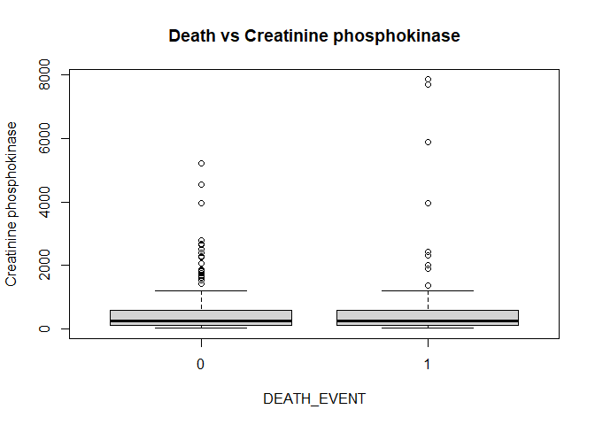
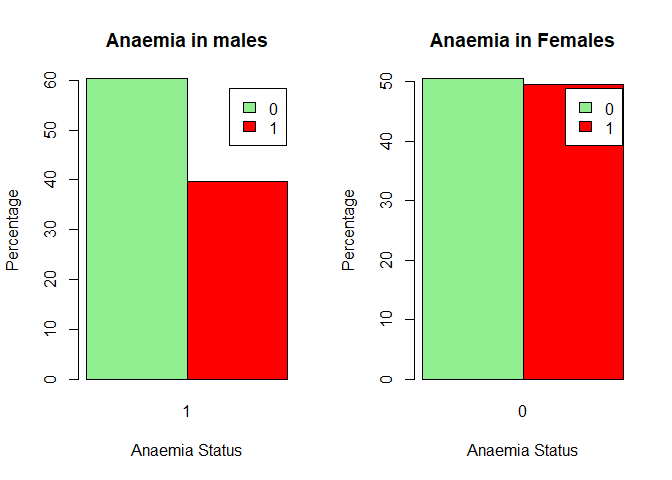

Survival of patients with heart failure
================

**Source of data:** UCI machine learning
repository:<https://archive.ics.uci.edu/dataset/519/heart+failure+clinical+records>

**Upload date of data:** 2nd April 2020

**Owner of the data:** The original dataset version was collected by
Tanvir Ahmad, Assia Munir, Sajjad Haider Bhatti, Muhammad Aftab, and
Muhammad Ali Raza in 2015. Current dataset has slight difference from
original dataset in terms of names of columns which was done by D.
Chicco and Giuseppe Jurman in their article published on BMC Medical
Informatics and Decision Making.
Link:<https://bmcmedinformdecismak.biomedcentral.com/articles/10.1186/s12911-020-1023-5#article-info>

**Objective of data collection:** Dataset was collected for analyzing
the survival pattern of heart failure patients who were admitted to
Institute of Cardiology and Allied hospital Faisalabad-Pakistan during
April-December (2015). And also rank the features which corresponds to
the most important risk factors.

**Analysis of data by other researchers:** D.Chicco and Giuseppe Jurman
found in their analysis that serum creatinine and ejection fraction
plays a very important role in understanding if a patient will survive
after heart failure or not.This discovery has the potential to impact on
clinical practice, becoming a new supporting tool for physicians when
predicting if a heart failure patient will survive or not.

**Description of data set:** This dataset was collected during
April–December 2015.It contains the medical records of 299 heart failure
patients collected at the Faisalabad Institute of Cardiology and at the
Allied Hospital in Faisalabad (Punjab, Pakistan). The patients consisted
of 105 women and 194 men, and their ages range between 40 and 95 years
old. All 299 patients had left ventricular systolic dysfunction and had
previous heart failures that put them in classes III or IV of New York
Heart Association (NYHA) classification of the stages of heart failure.
The dataset contains 13 features, which report clinical, body, and
lifestyle information.

**Description of columns:**

``` r
column_des<-read.csv("C:/Users/rajsh/OneDrive/Documents/Rproject/Book1.csv")
print(column_des)
```

    ##                          Feature
    ## 1                            Age
    ## 2                        Anaemia
    ## 3            High blood pressure
    ## 4  Creatinine phosphokinase(CPK)
    ## 5                       Diabetes
    ## 6              Ejection fraction
    ## 7                            Sex
    ## 8                      Platelets
    ## 9               Serum creatinine
    ## 10                  Serum sodium
    ## 11                       Smoking
    ## 12                          Time
    ## 13          (target) death event
    ##                                                  Explanation      Measurement
    ## 1                                         Age of the patient            Years
    ## 2                  Decrease of red blood cells or hemoglobin          Boolean
    ## 3                              If a patient has hypertension          Boolean
    ## 4                       Level of the CPK enzyme in the blood            mcg/L
    ## 5                                If the patient has diabetes          Boolean
    ## 6  Percentage of blood leaving the heart at each contraction       Percentage
    ## 7                                               Woman or man           Binary
    ## 8                                     Platelets in the blood kiloplatelets/mL
    ## 9                           Level of creatinine in the blood            mg/dL
    ## 10                              Level of sodium in the blood            mEq/L
    ## 11                                     If the patient smokes          Boolean
    ## 12                                          Follow-up period             Days
    ## 13           If the patient died during the follow-up period          Boolean
    ##                  Range
    ## 1         [40,..., 95]
    ## 2                 0, 1
    ## 3                 0, 1
    ## 4       [23,..., 7861]
    ## 5                 0, 1
    ## 6         [14,..., 80]
    ## 7                 0, 1
    ## 8  [25.01,..., 850.00]
    ## 9     [0.50,..., 9.40]
    ## 10      [114,..., 148]
    ## 11                0, 1
    ## 12         [4,...,285]
    ## 13                0, 1

The hospital physician considered a patient having **anaemia** if
haematocrit levels were lower than 36%.<br> The **creatinine
phosphokinase (CPK)** states the level of the CPK enzyme in blood. When
a muscle tissue gets damaged, CPK flows into the blood. Therefore, high
levels of CPK in the blood of a patient might indicate a heart failure
or injury.It is measured in microgram per litre (mcg/L).<br> The
**ejection fraction** states the percentage of how much blood the left
ventricle pumps out with each contraction.<br> The **serum creatinine**
is a waste product generated by creatine, when a muscle breaks
down.Doctors focus on serum creatinine in blood to check kidney
function. If a patient has high levels of serum creatinine, it may
indicate renal dysfunction.A normal range for serum creatinine is
approximately 0.6 to 1.3 milligrams per deciliter (mg/dL) for adult
males and 0.5 to 1.2 mg/dL for adult females.<br> The **serum sodium
test** is a routine blood exam that indicates if a patient has normal
levels of sodium in the blood. An abnormally low level of sodium(\<125
mEq/L) in the blood might be caused by heart failure.mEq/L represents
milliequivalents per liter.<br> The **death event** feature, that we use
as the target in our binary classification study, states if the patient
died or survived before the end of the follow-up period, that was 130
days on average.<br>

## **Purpose of my project:**Carrying out EDA to look for important factors for predicting survival of patients from heart failure and create a model using logistic regression to predict survival of patients.

``` r
#loading necessary libraries
library(ggplot2)
library(dplyr)
```

    ## 
    ## Attaching package: 'dplyr'

    ## The following objects are masked from 'package:stats':
    ## 
    ##     filter, lag

    ## The following objects are masked from 'package:base':
    ## 
    ##     intersect, setdiff, setequal, union

``` r
library(moments)
```

``` r
#Loading dataset 
df<-read.csv("C:/Users/rajsh/OneDrive/Documents/Rproject/heart_failure_clinical_records_dataset.csv")
head(df)
```

    ##   age anaemia creatinine_phosphokinase diabetes ejection_fraction
    ## 1  75       0                      582        0                20
    ## 2  55       0                     7861        0                38
    ## 3  65       0                      146        0                20
    ## 4  50       1                      111        0                20
    ## 5  65       1                      160        1                20
    ## 6  90       1                       47        0                40
    ##   high_blood_pressure platelets serum_creatinine serum_sodium sex smoking time
    ## 1                   1   265.000              1.9          130   1       0    4
    ## 2                   0   263.358              1.1          136   1       0    6
    ## 3                   0   162.000              1.3          129   1       1    7
    ## 4                   0   210.000              1.9          137   1       0    7
    ## 5                   0   327.000              2.7          116   0       0    8
    ## 6                   1   204.000              2.1          132   1       1    8
    ##   DEATH_EVENT
    ## 1           1
    ## 2           1
    ## 3           1
    ## 4           1
    ## 5           1
    ## 6           1

``` r
#Structure of data
cat("Shape of the dataset is:",dim(df),"\n")
```

    ## Shape of the dataset is: 299 13

``` r
str(df)
```

    ## 'data.frame':    299 obs. of  13 variables:
    ##  $ age                     : num  75 55 65 50 65 90 75 60 65 80 ...
    ##  $ anaemia                 : int  0 0 0 1 1 1 1 1 0 1 ...
    ##  $ creatinine_phosphokinase: int  582 7861 146 111 160 47 246 315 157 123 ...
    ##  $ diabetes                : int  0 0 0 0 1 0 0 1 0 0 ...
    ##  $ ejection_fraction       : int  20 38 20 20 20 40 15 60 65 35 ...
    ##  $ high_blood_pressure     : int  1 0 0 0 0 1 0 0 0 1 ...
    ##  $ platelets               : num  265 263 162 210 327 ...
    ##  $ serum_creatinine        : num  1.9 1.1 1.3 1.9 2.7 2.1 1.2 1.1 1.5 9.4 ...
    ##  $ serum_sodium            : int  130 136 129 137 116 132 137 131 138 133 ...
    ##  $ sex                     : int  1 1 1 1 0 1 1 1 0 1 ...
    ##  $ smoking                 : int  0 0 1 0 0 1 0 1 0 1 ...
    ##  $ time                    : int  4 6 7 7 8 8 10 10 10 10 ...
    ##  $ DEATH_EVENT             : int  1 1 1 1 1 1 1 1 1 1 ...

Since age is measured in years and platelets are count so they are
integer columns, thus converting them into integer. By description of
dataset we know that anaemia,high blood pressure,diabetes,sex and
smoking are categorical columns which are encoded with 0 and 1.

``` r
df$age <- as.integer(df$age)
str(df)
```

    ## 'data.frame':    299 obs. of  13 variables:
    ##  $ age                     : int  75 55 65 50 65 90 75 60 65 80 ...
    ##  $ anaemia                 : int  0 0 0 1 1 1 1 1 0 1 ...
    ##  $ creatinine_phosphokinase: int  582 7861 146 111 160 47 246 315 157 123 ...
    ##  $ diabetes                : int  0 0 0 0 1 0 0 1 0 0 ...
    ##  $ ejection_fraction       : int  20 38 20 20 20 40 15 60 65 35 ...
    ##  $ high_blood_pressure     : int  1 0 0 0 0 1 0 0 0 1 ...
    ##  $ platelets               : num  265 263 162 210 327 ...
    ##  $ serum_creatinine        : num  1.9 1.1 1.3 1.9 2.7 2.1 1.2 1.1 1.5 9.4 ...
    ##  $ serum_sodium            : int  130 136 129 137 116 132 137 131 138 133 ...
    ##  $ sex                     : int  1 1 1 1 0 1 1 1 0 1 ...
    ##  $ smoking                 : int  0 0 1 0 0 1 0 1 0 1 ...
    ##  $ time                    : int  4 6 7 7 8 8 10 10 10 10 ...
    ##  $ DEATH_EVENT             : int  1 1 1 1 1 1 1 1 1 1 ...

``` r
#Getting basic descriptive statistic summary of categorical columns
#For Anaemia
Anaemia_df <- data.frame(
  Anaemia = c("Present", "Absent"),
  Full_sampleNumber = c(sum(df$anaemia), 299 - sum(df$anaemia)),
  Full_samplePercentage = c(sum(df$anaemia) * 100 / nrow(df), (299 - sum(df$anaemia)) * 100 / nrow(df)),
  Dead_patientsNumber = c(sum(df[df$DEATH_EVENT == 1, ]$anaemia),sum(df$DEATH_EVENT)-sum(df[df$DEATH_EVENT == 1, ]$anaemia)),
  Dead_patientsPercentage = c(sum(df[df$DEATH_EVENT == 1, ]$anaemia) * 100 /sum(df$DEATH_EVENT), (sum(df$DEATH_EVENT)- sum(df[df$DEATH_EVENT == 1, ]$anaemia)) * 100 /sum(df$DEATH_EVENT)) ,
  Survived_patientsNumber = c(sum(df[df$DEATH_EVENT == 0, ]$anaemia), ((299-sum(df$DEATH_EVENT)) - sum(df[df$DEATH_EVENT == 0, ]$anaemia))),
  Survived_patientsPercentage = c(sum(df[df$DEATH_EVENT == 0, ]$anaemia) * 100 /(299-sum(df$DEATH_EVENT)) , ((299-sum(df$DEATH_EVENT)) - sum(df[df$DEATH_EVENT == 0, ]$anaemia)) * 100 / (299-sum(df$DEATH_EVENT)))
)
print(Anaemia_df)
```

    ##   Anaemia Full_sampleNumber Full_samplePercentage Dead_patientsNumber
    ## 1 Present               129              43.14381                  46
    ## 2  Absent               170              56.85619                  50
    ##   Dead_patientsPercentage Survived_patientsNumber Survived_patientsPercentage
    ## 1                47.91667                      83                     40.8867
    ## 2                52.08333                     120                     59.1133

``` r
#For High blood pressure
High_blood_pressure_df <- data.frame(
  High_blood_pressure = c("Present", "Absent"),
  Full_sampleNumber = c(sum(df$high_blood_pressure), 299 - sum(df$high_blood_pressure)),
  Full_samplePercentage = c(sum(df$high_blood_pressure) * 100 / nrow(df), (299 - sum(df$high_blood_pressure)) * 100 / nrow(df)),
  Dead_patientsNumber = c(sum(df[df$DEATH_EVENT == 1, ]$high_blood_pressure), sum(df$DEATH_EVENT) - sum(df[df$DEATH_EVENT == 1, ]$high_blood_pressure)),
  Dead_patientsPercentage = c(sum(df[df$DEATH_EVENT == 1, ]$high_blood_pressure) * 100 / sum(df$DEATH_EVENT), (sum(df$DEATH_EVENT) - sum(df[df$DEATH_EVENT == 1, ]$high_blood_pressure)) * 100 / sum(df$DEATH_EVENT)),
  Survived_patientsNumber = c(sum(df[df$DEATH_EVENT == 0, ]$high_blood_pressure), (299 - sum(df$DEATH_EVENT)) - sum(df[df$DEATH_EVENT == 0, ]$high_blood_pressure)),
  Survived_patientsPercentage = c(sum(df[df$DEATH_EVENT == 0, ]$high_blood_pressure) * 100 / (299 - sum(df$DEATH_EVENT)), ((299 - sum(df$DEATH_EVENT)) - sum(df[df$DEATH_EVENT == 0, ]$high_blood_pressure)) * 100 / (299 - sum(df$DEATH_EVENT)))
)
print(High_blood_pressure_df)
```

    ##   High_blood_pressure Full_sampleNumber Full_samplePercentage
    ## 1             Present               105              35.11706
    ## 2              Absent               194              64.88294
    ##   Dead_patientsNumber Dead_patientsPercentage Survived_patientsNumber
    ## 1                  39                  40.625                      66
    ## 2                  57                  59.375                     137
    ##   Survived_patientsPercentage
    ## 1                    32.51232
    ## 2                    67.48768

``` r
# For Diabetes
Diabetes_df <- data.frame(
  Diabetes = c("Present", "Absent"),
  Full_sampleNumber = c(sum(df$diabetes), 299 - sum(df$diabetes)),
  Full_samplePercentage = c(sum(df$diabetes) * 100 / nrow(df), (299 - sum(df$diabetes)) * 100 / nrow(df)),
  Dead_patientsNumber = c(sum(df[df$DEATH_EVENT == 1, ]$diabetes), sum(df$DEATH_EVENT) - sum(df[df$DEATH_EVENT == 1, ]$diabetes)),
  Dead_patientsPercentage = c(sum(df[df$DEATH_EVENT == 1, ]$diabetes) * 100 / sum(df$DEATH_EVENT), (sum(df$DEATH_EVENT) - sum(df[df$DEATH_EVENT == 1, ]$diabetes)) * 100 / sum(df$DEATH_EVENT)),
  Survived_patientsNumber = c(sum(df[df$DEATH_EVENT == 0, ]$diabetes), ((299 - sum(df$DEATH_EVENT)) - sum(df[df$DEATH_EVENT == 0, ]$diabetes))),
  Survived_patientsPercentage = c(sum(df[df$DEATH_EVENT == 0, ]$diabetes) * 100 / (299 - sum(df$DEATH_EVENT)), ((299 - sum(df$DEATH_EVENT)) - sum(df[df$DEATH_EVENT == 0, ]$diabetes)) * 100 / (299 - sum(df$DEATH_EVENT)))
)
print(Diabetes_df)
```

    ##   Diabetes Full_sampleNumber Full_samplePercentage Dead_patientsNumber
    ## 1  Present               125              41.80602                  40
    ## 2   Absent               174              58.19398                  56
    ##   Dead_patientsPercentage Survived_patientsNumber Survived_patientsPercentage
    ## 1                41.66667                      85                    41.87192
    ## 2                58.33333                     118                    58.12808

``` r
# For Sex 
Sex_df <- data.frame(
  Sex = c("Man", "Female"),
  Full_sampleNumber = c(sum(df$sex), 299 - sum(df$sex)),
  Full_samplePercentage = c(sum(df$sex) * 100 / nrow(df), (299 - sum(df$sex)) * 100 / nrow(df)),
  Dead_patientsNumber = c(sum(df[df$DEATH_EVENT == 1, ]$sex), sum(df$DEATH_EVENT) - sum(df[df$DEATH_EVENT == 1, ]$sex)),
  Dead_patientsPercentage = c(sum(df[df$DEATH_EVENT == 1, ]$sex) * 100 / sum(df$DEATH_EVENT), (sum(df$DEATH_EVENT) - sum(df[df$DEATH_EVENT == 1, ]$sex)) * 100 / sum(df$DEATH_EVENT)),
  Survived_patientsNumber = c(sum(df[df$DEATH_EVENT == 0, ]$sex), ((299 - sum(df$DEATH_EVENT)) - sum(df[df$DEATH_EVENT == 0, ]$sex))),
  Survived_patientsPercentage = c(sum(df[df$DEATH_EVENT == 0, ]$sex) * 100 / (299 - sum(df$DEATH_EVENT)), ((299 - sum(df$DEATH_EVENT)) - sum(df[df$DEATH_EVENT == 0, ]$sex)) * 100 / (299 - sum(df$DEATH_EVENT)))
)
print(Sex_df)
```

    ##      Sex Full_sampleNumber Full_samplePercentage Dead_patientsNumber
    ## 1    Man               194              64.88294                  62
    ## 2 Female               105              35.11706                  34
    ##   Dead_patientsPercentage Survived_patientsNumber Survived_patientsPercentage
    ## 1                64.58333                     132                    65.02463
    ## 2                35.41667                      71                    34.97537

``` r
# For Smoking
Smoking_df <- data.frame(
  Smoking = c("Present", "Absent"),
  Full_sampleNumber = c(sum(df$smoking), 299 - sum(df$smoking)),
  Full_samplePercentage = c(sum(df$smoking) * 100 / nrow(df), (299 - sum(df$smoking)) * 100 / nrow(df)),
  Dead_patientsNumber = c(sum(df[df$DEATH_EVENT == 1, ]$smoking), sum(df$DEATH_EVENT) - sum(df[df$DEATH_EVENT == 1, ]$smoking)),
  Dead_patientsPercentage = c(sum(df[df$DEATH_EVENT == 1, ]$smoking) * 100 / sum(df$DEATH_EVENT), (sum(df$DEATH_EVENT) - sum(df[df$DEATH_EVENT == 1, ]$smoking)) * 100 / sum(df$DEATH_EVENT)),
  Survived_patientsNumber = c(sum(df[df$DEATH_EVENT == 0, ]$smoking), ((299 - sum(df$DEATH_EVENT)) - sum(df[df$DEATH_EVENT == 0, ]$smoking))),
  Survived_patientsPercentage = c(sum(df[df$DEATH_EVENT == 0, ]$smoking) * 100 / (299 - sum(df$DEATH_EVENT)), ((299 - sum(df$DEATH_EVENT)) - sum(df[df$DEATH_EVENT == 0, ]$smoking)) * 100 / (299 - sum(df$DEATH_EVENT)))
)
print(Smoking_df)
```

    ##   Smoking Full_sampleNumber Full_samplePercentage Dead_patientsNumber
    ## 1 Present                96              32.10702                  30
    ## 2  Absent               203              67.89298                  66
    ##   Dead_patientsPercentage Survived_patientsNumber Survived_patientsPercentage
    ## 1                   31.25                      66                    32.51232
    ## 2                   68.75                     137                    67.48768

**We can clearly observe that:**<br> 1) Out of 299 patients 129 were
found to have anaemia which is about 43% of total population. Only
64.34% patient who had anaemia could survive till follow-up period.<br>
2) Out of 299 patients 105 were found to have high blood pressure which
is about 35% of total population. Only 62.85% patient who had high blood
pressure could survive till follow-up period.<br> 3) Out of 299 patients
125 were found to have diabetes which is about 42% of total population.
Only 68% patient who had diabetes could survive till follow-up
period.<br> 4) Male constituted 64.88% and Female constituted 35.12% of
total population.<br> 5) Out of 299 patients 96 were found to have
diabetes which is about 32% of total population. Only 68.75% patient who
had diabetes could survive till follow-up period.<br>

**Univariate analysis**

``` r
#Getting basic descriptive statistic summary of age column
cat("For age","\n")
```

    ## For age

``` r
summary(df$age)
```

    ##    Min. 1st Qu.  Median    Mean 3rd Qu.    Max. 
    ##   40.00   51.00   60.00   60.83   70.00   95.00

``` r
cat("Standard deviation:",sd(df$age),"\n")
```

    ## Standard deviation: 11.895

``` r
cat("Skewness:",skewness(df$age),"\n")
```

    ## Skewness: 0.4220415

``` r
cat("Kurtosis:",kurtosis(df$age),"\n","\n")
```

    ## Kurtosis: 2.798664 
    ## 

``` r
#For age
par(mfrow=c(1,2))
hist(df$age,main="Age",xlab="age")
boxplot(df$age,main="Age")
```

<!-- -->

``` r
par(mfrow=c(1,1))
```

Age of patients lie between range 40-95 years with average age of 60.83
years and standard deviation of 11.895.<br> Most of the patients have
age 55-65 years.<br>

``` r
#Getting basic descriptive statistic summary of Creatinine phosphokinase
cat("For creatinine_phosphokinase","\n")
```

    ## For creatinine_phosphokinase

``` r
summary(df$creatinine_phosphokinase)
```

    ##    Min. 1st Qu.  Median    Mean 3rd Qu.    Max. 
    ##    23.0   116.5   250.0   581.8   582.0  7861.0

``` r
cat("Standard deviation:",sd(df$creatinine_phosphokinase),"\n")
```

    ## Standard deviation: 970.2879

``` r
cat("Skewness:",skewness(df$creatinine_phosphokinase),"\n")
```

    ## Skewness: 4.440689

``` r
cat("Kurtosis:",kurtosis(df$creatinine_phosphokinase),"\n","\n")
```

    ## Kurtosis: 27.71046 
    ## 

``` r
#For Creatinine phosphokinase
par(mfrow=c(1,2))
hist(df$creatinine_phosphokinase,main="Creatinine phosphokinase",xlab="creatinine_phosphokinase")
boxplot(df$creatinine_phosphokinase,main="Creatinine phosphokinase")
```

<!-- -->

``` r
par(mfrow=c(1,1))
```

Creatinine phosphokinase column is highly right skewed & peaked with
range of 23-7861,standard deviation of 970.28, Skewness of 4.44
,kurtosis of 27.7.<br> From the box-plot we can see that it has many
outliers.<br>

``` r
#Getting basic descriptive statistic summary of Ejection fraction
cat("For ejection_fraction","\n")
```

    ## For ejection_fraction

``` r
summary(df$ejection_fraction)
```

    ##    Min. 1st Qu.  Median    Mean 3rd Qu.    Max. 
    ##   14.00   30.00   38.00   38.08   45.00   80.00

``` r
cat("Standard deviation:",sd(df$ejection_fraction),"\n")
```

    ## Standard deviation: 11.83484

``` r
cat("Skewness:",skewness(df$ejection_fraction),"\n")
```

    ## Skewness: 0.5525927

``` r
cat("Kurtosis:",kurtosis(df$ejection_fraction),"\n","\n")
```

    ## Kurtosis: 3.02072 
    ## 

``` r
#For Ejection fraction
par(mfrow=c(1,2))
hist(df$ejection_fraction, main="Ejection Fraction", xlab="Ejection Fraction")
boxplot(df$ejection_fraction, main="Ejection Fraction")
```

<!-- -->

``` r
par(mfrow=c(1,1))
```

Ejection fraction column has range of 14-80 ,mean of 38.08 ,standard
deviation of 11.83, Skewness of 0.55 ,kurtosis of 3.02.<br>

``` r
#Getting basic descriptive statistic summary of Platelets
cat("For plateles","\n")
```

    ## For plateles

``` r
summary(df$platelets)
```

    ##    Min. 1st Qu.  Median    Mean 3rd Qu.    Max. 
    ##    25.1   211.5   262.0   262.7   303.5   850.0

``` r
cat("Standard deviation:",sd(df$platelets),"\n")
```

    ## Standard deviation: 98.39959

``` r
cat("Skewness:",skewness(df$platelets),"\n")
```

    ## Skewness: 1.425942

``` r
cat("Kurtosis:",kurtosis(df$platelets),"\n","\n")
```

    ## Kurtosis: 8.950815 
    ## 

``` r
#For Platelets 
par(mfrow=c(1,2))
hist(df$platelets, main="Platelets", xlab="Platelets")
boxplot(df$platelets, main="Platelets")
```

<!-- -->

``` r
par(mfrow=c(1,1))
```

Platelets column is high peaked column with range of 25100-850000,mean
of 263358 ,standard deviation of 97804.24, Skewness of 1.45 ,kurtosis of
9.08.<br> From the box-plot we can see that it has many outliers.<br>

``` r
#Getting basic descriptive statistic summary of Serum creatinine 
cat("For serum_creatinine","\n")
```

    ## For serum_creatinine

``` r
summary(df$serum_creatinine)
```

    ##    Min. 1st Qu.  Median    Mean 3rd Qu.    Max. 
    ##   0.500   0.900   1.100   1.394   1.400   9.400

``` r
cat("Standard deviation:",sd(df$serum_creatinine),"\n")
```

    ## Standard deviation: 1.03451

``` r
cat("Skewness:",skewness(df$serum_creatinine),"\n")
```

    ## Skewness: 4.43361

``` r
cat("Kurtosis:",kurtosis(df$serum_creatinine),"\n","\n")
```

    ## Kurtosis: 28.37835 
    ## 

``` r
#For Serum creatinine 
par(mfrow=c(1,2))
hist(df$serum_creatinine, main="Serum Creatinine", xlab="Serum Creatinine")
boxplot(df$serum_creatinine, main="Serum Creatinine")
```

<!-- -->

``` r
par(mfrow=c(1,1))
```

Serum creatinine is highly right skewed & peaked with range of 0.5-9.4,
standard deviation of 1.03,Skewness of 4.43 ,kurtosis of 28.37.<br> From
the box-plot we can see that it has many outliers.<br>

``` r
#Getting basic descriptive statistic summary of Serum sodium
cat("For serum_sodium","\n")
```

    ## For serum_sodium

``` r
summary(df$serum_sodium)
```

    ##    Min. 1st Qu.  Median    Mean 3rd Qu.    Max. 
    ##   113.0   134.0   137.0   136.6   140.0   148.0

``` r
cat("Standard deviation:",sd(df$serum_sodium),"\n")
```

    ## Standard deviation: 4.412477

``` r
cat("Skewness:",skewness(df$serum_sodium),"\n")
```

    ## Skewness: -1.04287

``` r
cat("Kurtosis:",kurtosis(df$serum_sodium),"\n","\n")
```

    ## Kurtosis: 7.031142 
    ## 

``` r
#For Serum sodium
par(mfrow=c(1,2))
hist(df$serum_sodium, main="Serum Sodium", xlab="Serum Sodium")
boxplot(df$serum_sodium, main="Serum Sodium")
```

<!-- -->

``` r
par(mfrow=c(1,1))
```

Serum sodium has range of 113-148, mean of 136.6, standard deviation of
4.41,Skewness of -1.04,kurtosis of 7.03.<br> It is left skewed.<br>

``` r
#Getting basic descriptive statistic summary of Death event
cat("For time","\n")
```

    ## For time

``` r
summary(df$time)
```

    ##    Min. 1st Qu.  Median    Mean 3rd Qu.    Max. 
    ##     4.0    73.0   115.0   130.3   203.0   285.0

``` r
cat("Standard deviation:",sd(df$time),"\n")
```

    ## Standard deviation: 77.61421

``` r
cat("Skewness:",skewness(df$time),"\n")
```

    ## Skewness: 0.1271606

``` r
cat("Kurtosis:",kurtosis(df$time),"\n")
```

    ## Kurtosis: 1.788126

``` r
hist(df$time)
```

<!-- -->

``` r
#For Death event
ggplot(df, aes(x =  DEATH_EVENT)) +geom_bar(fill = "lightblue") +labs(title = " DEATH EVENT", x = " DEATH_EVENT", y = "Frequency")
```

<!-- -->

``` r
pie(table(df$ DEATH_EVENT), labels = paste0(names(table(df$ DEATH_EVENT)), ": ", round(table(df$ DEATH_EVENT)/sum(table(df$ DEATH_EVENT)) * 100, 2), "%"),main = " DEATH_EVENT Distribution", col = c("red", "lightgreen"))
```

<!-- -->
Among 299 patients 67.89% died before follow-up period.<br>

**Bivariate analysis**

``` r
#Death vs Age
boxplot(df$age ~ df$DEATH_EVENT, main = "Death vs Age", xlab = "DEATH_EVENT", ylab = "Age")
```

<!-- -->
From death vs age plot we see that young age group people have more
chances of survival.<br>

``` r
#Death vs Creatinine phosphokinase
boxplot(df$creatinine_phosphokinase ~ df$DEATH_EVENT, main = "Death vs Creatinine phosphokinase", xlab = "DEATH_EVENT", ylab = "Creatinine phosphokinase")
```

<!-- -->

``` r
df_summary <- df %>%
  group_by(DEATH_EVENT) %>%
  summarize(mean_cpk = mean(creatinine_phosphokinase))

# Draw a line plot with the summary data
plot(df_summary$DEATH_EVENT, df_summary$mean_cpk, type = "l",
     xlab = "Death Event", ylab = "Mean Creatinine Phosphokinase",col="red",lty=2)
```

<!-- -->
From the line plot we can see that on an average the patients who died
had high value of CPK.We might consider it as potential factor to
predict survival of patients.But since the range of CPK was too high
than its mean so we cannot say with high certainty that it is a good
factor to predict survival.<br>

``` r
#Death vs Ejection fraction
boxplot(df$ejection_fraction ~ df$DEATH_EVENT, main = "Death vs Ejection fraction", xlab = "DEATH_EVENT", ylab = "Ejection fraction")
```

<!-- -->
Ejection fraction vs death plot reveals that the people who died had low
value of ejection fraction i.e. left ventricle does not pumps
effectively with each contraction.<br>

``` r
#Death vs Platelets
boxplot(df$platelets ~ df$DEATH_EVENT, main = "Death vs Platelets", xlab = "DEATH_EVENT", ylab = "Platelets")
```

<!-- -->

``` r
df_summary <- df %>%
  group_by(DEATH_EVENT) %>%
  summarize(mean_plat = mean(platelets))

# Draw a line plot with the summary data
plot(df_summary$DEATH_EVENT, df_summary$mean_plat, type = "l",
     xlab = "Death Event", ylab = "Mean Platelets",col="red",lty=2)
```

<!-- -->
On Average plateletes count remained same for patients who survived and
who died. Since there is very slight cange in average of platelets
count.<br>

``` r
#Death vs Serum creatinine
boxplot(df$serum_creatinine ~ df$DEATH_EVENT, main = "Death vs Serum creatinine", xlab = "DEATH_EVENT", ylab = "Serum creatinine")
```

<!-- -->
High value for Serum creatinine was observed for patients who died
telling that it can be potential factor for predicting survival of
patients.<br>

``` r
#Death vs Serum sodium
boxplot(df$serum_sodium ~ df$DEATH_EVENT, main = "Death vs Serum sodium", xlab = "DEATH_EVENT", ylab = "Serum sodium")
```

<!-- -->
Low value for Serum sodium was observed for patients who died telling
that it can be potential factor for predicting survival of patients.<br>

\#Analysis of survival and sex of patients taken together

``` r
#Death&Sex vs Age
boxplot(df$age ~ interaction(df$DEATH_EVENT,df$sex), main = "Death&Sex vs Age", xlab = "DEATH_EVENT & SEX", ylab = "Age",names=c("Survived_Female","Death_Female","Survived_male","Death_male"))
```

<!-- -->
Among all patients male patients who were younger had high chances of
survival since among those males who died older ones were majority.And
same is observed for females.<br>

``` r
#Death&Sex vs Serum Creatinine
boxplot(df$serum_creatinine ~ interaction(df$DEATH_EVENT,df$sex), main = "Death&Sex vs Serum Creatinine", xlab = "DEATH_EVENT & SEX", ylab = "Serum Creatinine",names=c("Survived_Female","Death_Female","Survived_male","Death_male"))
```

<!-- -->
In both males and females the patients who had high level of Serum
Creatinine died before follow up period.<br> \#Relationship between
different feature columns

``` r
#Anaemia vs Age
boxplot(df$age ~ df$anaemia, main = "Anaemia vs Age", xlab = "Anaemia", ylab = "Age")
legend("topright", legend = c("Absent = 0", "Present = 1"),cex=0.8)
```

<!-- -->
On average age remained same for patients who had anaemia and who didn’t
have anaemia.

``` r
#Diabetes vs Age
boxplot(df$age ~ df$diabetes, main = "Diabetes vs Age", xlab = "Diabetes", ylab = "Age")
legend("topright", legend = c("Absent = 0", "Present = 1"),cex=0.8)
```

<!-- -->
On average age remained same for patients who had diabetes and who
didn’t have diabetes.

``` r
#High blood pressure vs Age
boxplot(df$age ~ df$high_blood_pressure, main = "High blood pressures vs Age", xlab = "High blood pressure", ylab = "Age")
legend("topright", legend = c("Absent = 0", "Present = 1"),cex=0.8)
```

<!-- -->
Patients who had high blood pressure were slightly aged than those who
didn’t had high blood pressure.<br>

``` r
#Anaemia & Sex
df_males <- subset(df, sex == 1)
df_females <- subset(df, sex == 0)

# Create a table for anaemia and sex
x <- table(df_males$anaemia, df_males$sex)
y <- table(df_females$anaemia, df_females$sex)
x_percentage <- prop.table(x, margin = 2) * 100
y_percentage <- prop.table(y, margin = 2) * 100  # Calculate percentages across columns (sex)

par(mfrow=c(1,2))
# Barplot for males with percentages
barplot(x_percentage, beside = TRUE, col = c("lightgreen", "red"), 
        legend = rownames(y_percentage), main = "Anaemia in males",
        xlab = "Anaemia Status", ylab = "Percentage")
# Barplot for females with percentages
barplot(y_percentage, beside = TRUE, col = c("lightgreen", "red"), 
        legend = rownames(y_percentage), main = "Anaemia in Females",
        xlab = "Anaemia Status", ylab = "Percentage")
```

<!-- -->
Among male patients around 40% had anaemia and among female around 50%
had anaemia.That may mean that females are more prone to anaemia.<br>

``` r
df_males <- subset(df, sex == 1)
df_females <- subset(df, sex == 0)

# Create a table for diabetes and sex
x <- table(df_males$diabetes, df_males$sex)
y <- table(df_females$diabetes, df_females$sex)
x_percentage <- prop.table(x, margin = 2) * 100
y_percentage <- prop.table(y, margin = 2) * 100  # Calculate percentages across columns (sex)

par(mfrow=c(1,2))
# Barplot for males with percentages
barplot(x_percentage, beside = TRUE, col = c("lightgreen", "red"), 
        legend = rownames(y_percentage), main = "Diabetes in Males",
        xlab = "Diabetes Status", ylab = "Percentage")
# Barplot for females with percentages
barplot(y_percentage, beside = TRUE, col = c("lightgreen", "red"), 
        legend = rownames(y_percentage), main = "Diabetes in Females",
        xlab = "Diabetes Status", ylab = "Percentage")
```

<!-- -->
Among male patients around 35% had diabetes and among female around 52%
had diabetes.That may mean that females are more prone to diabetes.<br>

``` r
#Smoking vs Ejection fraction
boxplot(df$ejection_fraction ~ df$smoking, main = "Smoking vs Ejection fraction", xlab = "Smoking", ylab = "Ejection fraction")
legend("topright", legend = c("Non smoker = 0", "Smoker = 1"),cex=0.8)
```

<!-- -->
Smoker patients had low value of ejection fraction, meaning that smoking
may cause decrease in the pumping capacity of heart.<br>

``` r
#Creatinine phosphokinase vs Ejection fraction
plot(x=df$creatinine_phosphokinase,y=df$ejection_fraction,main="Creatinine phosphokinase vs Ejection fraction",xlab="Creatinine phosphokinase",ylab="Ejection fraction",type="p")
abline(lm(df$ejection_fraction~df$creatinine_phosphokinase),col="red")
```

<!-- -->
We can see from the graph that as the CPK level increases ejection
fraction decreases representing that blood pumping capacity of heart
decrease whenever heart injury occurs.

``` r
#Creatinine phosphokinase vs Serum Creatinine
plot(x=df$creatinine_phosphokinase,y=df$serum_creatinine,main="Creatinine phosphokinase vs Serum Creatinine",xlab="Creatinine phosphokinase",ylab="Serum Creatinine")
abline(lm(df$serum_creatinine~df$creatinine_phosphokinase),col="red")
```

<!-- -->

``` r
#Creatinine phosphokinase vs Serum sodium
plot(x=df$creatinine_phosphokinase,y=df$serum_sodium,main="Creatinine phosphokinase vs Serum sodium",xlab="Creatinine phosphokinase",ylab="Serum sodium")
abline(lm(df$serum_sodium~df$creatinine_phosphokinase),col="red")
```

<!-- -->

``` r
#Creatinine phosphokinase vs Platelets
plot(x=df$creatinine_phosphokinase,y=df$platelets,main="Creatinine phosphokinase vs Platelets",xlab="Creatinine phosphokinase",ylab="Platelets")
abline(lm(df$platelets~df$creatinine_phosphokinase),col="red")
```

<!-- -->

**Key findings:**<br> 1)Ejection fraction, Serum sodium and Serum
creatinine can be considered as important factors to predict survival of
patients. 2)Females are more prone to anaemia and diabetes than males.
3)Smoking can cause decrease in pumping capacity of heart. 4)Presence of
CPK enzyme may be considered for detection of heart injury.

**Splitting Dataset into training and testing data**

``` r
train_indices <- sample(1:nrow(df), 0.75 * nrow(df),replace = F)
train_data <- df[train_indices, ]
test_data <- df[-train_indices, ]
train_data
```

    ##     age anaemia creatinine_phosphokinase diabetes ejection_fraction
    ## 273  67       0                      213        0                38
    ## 139  62       0                      281        1                35
    ## 34   50       1                      159        1                30
    ## 248  64       0                      143        0                25
    ## 181  40       0                      478        1                30
    ## 291  45       0                      615        1                55
    ## 289  65       0                      892        1                35
    ## 156  60       1                      231        1                25
    ## 146  50       0                      185        0                30
    ## 17   87       1                      149        0                38
    ## 70   65       0                      113        1                25
    ## 149  75       1                      582        0                30
    ## 298  45       0                     2413        0                38
    ## 177  69       0                     1419        0                40
    ## 283  42       0                       64        0                30
    ## 183  65       0                      395        1                25
    ## 137  65       1                       59        1                60
    ## 99   60       1                      156        1                25
    ## 279  50       1                     1051        1                30
    ## 68   72       1                      110        0                25
    ## 224  47       0                      582        0                25
    ## 103  80       0                      898        0                25
    ## 130  53       1                      270        1                35
    ## 67   42       1                      250        1                15
    ## 109  63       0                      936        0                38
    ## 155  65       1                      335        0                35
    ## 164  50       1                     2334        1                35
    ## 30   82       0                       70        1                30
    ## 166  80       0                      776        1                38
    ## 8    60       1                      315        1                60
    ## 121  60       1                      737        0                60
    ## 82   67       0                      582        0                50
    ## 79   75       1                      203        1                38
    ## 294  63       1                      103        1                35
    ## 105  60       0                       53        0                50
    ## 25   75       0                      582        1                30
    ## 262  62       1                      655        0                40
    ## 171  51       1                      582        1                35
    ## 195  45       0                      582        0                20
    ## 114  70       1                      143        0                60
    ## 87   55       0                       47        0                35
    ## 10   80       1                      123        0                35
    ## 138  68       1                      646        0                25
    ## 193  50       1                      121        1                40
    ## 236  77       1                      109        0                50
    ## 238  70       0                      232        0                30
    ## 286  55       1                      170        1                40
    ## 207  40       1                      101        0                40
    ## 256  52       1                      191        1                30
    ## 245  54       0                      582        1                38
    ## 230  72       0                      211        0                25
    ## 293  52       0                      190        1                38
    ## 172  52       0                     3966        0                40
    ## 276  45       0                      582        0                38
    ## 287  60       0                      253        0                35
    ## 296  55       0                     1820        0                38
    ## 88   65       1                       68        1                60
    ## 216  73       0                      582        0                35
    ## 285  50       1                       54        0                40
    ## 22   65       1                      128        1                30
    ## 200  60       0                     1211        1                35
    ## 31   94       0                      582        1                38
    ## 163  63       1                      582        0                40
    ## 101  65       1                      305        0                25
    ## 142  46       1                      291        0                35
    ## 266  50       1                      298        0                35
    ## 40   60       0                      235        1                38
    ## 202  45       0                      308        1                60
    ## 116  58       1                      400        0                40
    ## 275  60       1                      257        1                30
    ## 227  58       1                       57        0                25
    ## 135  81       0                     4540        0                35
    ## 50   57       1                      129        0                30
    ## 288  45       0                      582        1                55
    ## 23   68       1                      220        0                35
    ## 32   85       0                       23        0                45
    ## 233  40       1                      129        0                35
    ## 223  42       1                       86        0                35
    ## 15   49       1                       80        0                30
    ## 21   65       1                       52        0                25
    ## 225  58       0                      582        1                25
    ## 147  52       0                      132        0                30
    ## 140  50       0                     1548        0                30
    ## 18   45       0                      582        0                14
    ## 1    75       0                      582        0                20
    ## 170  70       0                      835        0                35
    ## 4    50       1                      111        0                20
    ## 234  53       1                      707        0                38
    ## 65   45       0                      582        0                80
    ## 136  75       0                      582        0                40
    ## 102  75       0                      582        0                45
    ## 204  60       0                       59        0                25
    ## 228  55       1                     2794        0                35
    ## 290  90       1                      337        0                38
    ## 28   70       0                      122        1                45
    ## 179  63       1                      122        1                60
    ## 244  73       1                     1185        0                40
    ## 5    65       1                      160        1                20
    ## 249  40       0                      624        0                35
    ## 162  45       1                      130        0                35
    ## 167  53       0                      196        0                60
    ## 37   90       1                       60        1                50
    ## 16   82       1                      379        0                50
    ## 78   42       0                      102        1                40
    ## 178  49       1                       69        0                50
    ## 185  58       1                      145        0                25
    ## 187  50       0                      582        0                50
    ## 20   48       1                      582        1                55
    ## 255  53       1                      446        0                60
    ## 92   60       0                      897        1                45
    ## 24   53       0                       63        1                60
    ## 175  65       0                      198        1                35
    ## 274  42       0                       64        0                40
    ## 12   62       0                      231        0                25
    ## 56   95       1                      371        0                30
    ## 229  65       0                       56        0                25
    ## 45   60       1                      588        1                60
    ## 159  85       1                      910        0                50
    ## 215  65       1                      135        0                35
    ## 9    65       0                      157        0                65
    ## 259  45       1                       66        1                25
    ## 218  54       1                      427        0                70
    ## 43   70       0                      571        1                45
    ## 251  50       0                     2522        0                30
    ## 265  61       0                      582        1                38
    ## 240  55       1                      180        0                45
    ## 168  59       0                       66        1                20
    ## 272  51       0                      582        1                40
    ## 93   42       0                      582        0                60
    ## 153  50       0                      115        0                45
    ## 160  59       1                      129        0                45
    ## 95   58       0                      144        1                38
    ## 39   60       0                     2656        1                30
    ## 91   70       0                       66        1                45
    ## 297  45       0                     2060        1                60
    ## 151  72       0                      233        0                45
    ## 96   58       1                      133        0                60
    ## 277  70       0                      618        0                35
    ## 81   70       0                       69        0                40
    ## 117  60       1                       96        1                60
    ## 269  45       0                      582        1                38
    ## 100  63       1                       61        1                40
    ## 268  56       1                      135        1                38
    ## 3    65       0                      146        0                20
    ## 154  50       0                     1846        1                35
    ## 94   60       1                      154        0                25
    ## 198  65       0                      167        0                30
    ## 250  53       0                      207        1                40
    ## 237  75       0                      119        0                50
    ## 189  60       1                      151        1                40
    ## 26   80       0                      148        1                38
    ## 57   70       1                       75        0                35
    ## 104  42       0                     5209        0                30
    ## 169  65       0                      582        1                40
    ## 111  85       0                      129        0                60
    ## 63   55       0                      109        0                35
    ## 46   50       0                      582        1                38
    ## 186  60       1                      104        1                30
    ## 221  73       0                      582        0                20
    ## 278  70       0                      582        1                38
    ## 246  61       1                       80        1                38
    ## 115  60       1                      754        1                40
    ## 2    55       0                     7861        0                38
    ## 222  65       0                      118        0                50
    ## 90   57       1                      115        0                25
    ## 122  66       1                       68        1                38
    ## 113  50       0                      369        1                25
    ## 127  46       0                      168        1                17
    ## 190  40       0                      244        0                45
    ## 132  60       1                     1082        1                45
    ## 239  65       1                      720        1                40
    ## 254  70       0                       88        1                35
    ## 152  62       0                       30        1                60
    ## 295  62       0                       61        1                38
    ## 180  55       0                      835        0                40
    ## 29   58       1                       60        0                38
    ## 119  65       1                      113        1                60
    ## 52   53       1                       91        0                20
    ## 42   50       0                      124        1                30
    ## 44   72       0                      127        1                50
    ## 112  55       0                       60        0                35
    ## 51   68       1                      577        0                25
    ## 165  45       0                     2442        1                30
    ## 141  80       0                      805        0                38
    ## 19   70       1                      125        0                25
    ## 110  45       0                      292        1                35
    ## 86   51       0                       78        0                50
    ## 77   70       0                       92        0                60
    ## 243  40       0                       90        0                35
    ## 73   85       0                     5882        0                35
    ## 199  50       1                      582        1                20
    ## 35   65       0                       94        1                50
    ## 76   60       1                       47        0                20
    ## 7    75       1                      246        0                15
    ## 220  55       0                      582        1                35
    ## 214  48       1                      131        1                30
    ## 247  55       0                     2017        0                25
    ## 226  75       0                      675        1                60
    ## 284  65       0                     1688        0                38
    ## 64   45       0                      582        0                35
    ## 14   50       1                      168        0                38
    ## 120  86       0                      582        0                38
    ## 182  59       1                      176        1                25
    ## 191  80       0                      582        1                35
    ## 212  50       0                      582        0                62
    ## 89   44       0                       84        1                40
    ## 6    90       1                       47        0                40
    ## 271  44       0                      582        1                30
    ## 261  55       0                       66        0                40
    ## 133  46       0                      719        0                40
    ## 38   82       1                      855        1                50
    ## 108  45       1                     1876        1                35
    ## 161  66       1                       72        0                40
    ## 231  60       0                      166        0                30
    ## 54   70       1                       69        1                50
    ## 270  40       0                      582        1                35
    ## 62   50       0                      318        0                40
    ## 206  50       1                      167        1                45
    ## 49   80       1                      553        0                20
    ## 203  70       0                       97        0                60
    ## 98   70       1                       59        0                60
    ## 72   58       0                      582        1                35
    ## 125  60       0                      582        0                40
    ## 129  61       0                      248        0                30
    ##     high_blood_pressure platelets serum_creatinine serum_sodium sex smoking
    ## 273                   0   215.000             1.20          133   0       0
    ## 139                   0   221.000             1.00          136   0       0
    ## 34                    0   302.000             1.20          138   0       0
    ## 248                   0   246.000             2.40          135   1       0
    ## 181                   0   303.000             0.90          136   1       0
    ## 291                   0   222.000             0.80          141   0       0
    ## 289                   0   263.358             1.10          142   0       0
    ## 156                   0   194.000             1.70          140   1       0
    ## 146                   0   266.000             0.70          141   1       1
    ## 17                    0   262.000             0.90          140   1       0
    ## 70                    0   497.000             1.83          135   1       0
    ## 149                   0   225.000             1.83          134   1       0
    ## 298                   0   140.000             1.40          140   1       1
    ## 177                   0   105.000             1.00          135   1       1
    ## 283                   0   215.000             3.80          128   1       1
    ## 183                   0   265.000             1.20          136   1       1
    ## 137                   0   172.000             0.90          137   0       0
    ## 99                    1   318.000             1.20          137   0       0
    ## 279                   0   232.000             0.70          136   0       0
    ## 68                    0   274.000             1.00          140   1       1
    ## 224                   0   130.000             0.80          134   1       0
    ## 103                   0   149.000             1.10          144   1       1
    ## 130                   0   227.000             3.40          145   1       0
    ## 67                    0   213.000             1.30          136   0       0
    ## 109                   0   304.000             1.10          133   1       1
    ## 155                   1   235.000             0.80          136   0       0
    ## 164                   0    75.000             0.90          142   0       0
    ## 30                    0   200.000             1.20          132   1       1
    ## 166                   1   192.000             1.30          135   0       0
    ## 8                     0   454.000             1.10          131   1       1
    ## 121                   1   210.000             1.50          135   1       1
    ## 82                    0   263.358             1.18          137   1       1
    ## 79                    1   283.000             0.60          131   1       1
    ## 294                   0   179.000             0.90          136   1       1
    ## 105                   1   286.000             2.30          143   0       0
    ## 25                    1   263.358             1.83          134   0       0
    ## 262                   0   283.000             0.70          133   0       0
    ## 171                   0   263.358             1.50          136   1       1
    ## 195                   1   126.000             1.60          135   1       0
    ## 114                   0   351.000             1.30          137   0       0
    ## 87                    1   173.000             1.10          137   1       0
    ## 10                    1   388.000             9.40          133   1       1
    ## 138                   0   305.000             2.10          130   1       0
    ## 193                   0   260.000             0.70          130   1       0
    ## 236                   1   406.000             1.10          137   1       0
    ## 238                   0   173.000             1.20          132   1       0
    ## 286                   0   336.000             1.20          135   1       0
    ## 207                   0   226.000             0.80          141   0       0
    ## 256                   1   334.000             1.00          142   1       1
    ## 245                   0   264.000             1.80          134   1       0
    ## 230                   0   274.000             1.20          134   0       0
    ## 293                   0   382.000             1.00          140   1       1
    ## 172                   0   325.000             0.90          140   1       1
    ## 276                   1   422.000             0.80          137   0       0
    ## 287                   0   279.000             1.70          140   1       0
    ## 296                   0   270.000             1.20          139   0       0
    ## 88                    1   304.000             0.80          140   1       0
    ## 216                   1   203.000             1.30          134   1       0
    ## 285                   0   279.000             0.80          141   1       0
    ## 22                    1   297.000             1.60          136   0       0
    ## 200                   0   263.358             1.80          113   1       1
    ## 31                    1   263.358             1.83          134   1       0
    ## 163                   0   448.000             0.90          137   1       1
    ## 101                   0   298.000             1.10          141   1       0
    ## 142                   0   348.000             0.90          140   0       0
    ## 266                   0   362.000             0.90          140   1       1
    ## 40                    0   329.000             3.00          142   0       0
    ## 202                   1   377.000             1.00          136   1       0
    ## 116                   0   164.000             1.00          139   0       0
    ## 275                   0   150.000             1.00          137   1       1
    ## 227                   0   189.000             1.30          132   1       1
    ## 135                   0   231.000             1.18          137   1       1
    ## 50                    0   395.000             1.00          140   0       0
    ## 288                   0   543.000             1.00          132   0       0
    ## 23                    1   289.000             0.90          140   1       1
    ## 32                    0   360.000             3.00          132   1       0
    ## 233                   0   255.000             0.90          137   1       0
    ## 223                   0   365.000             1.10          139   1       1
    ## 15                    1   427.000             1.00          138   0       0
    ## 21                    1   276.000             1.30          137   0       0
    ## 225                   0   504.000             1.00          138   1       0
    ## 147                   0   218.000             0.70          136   1       1
    ## 140                   1   211.000             0.80          138   1       0
    ## 18                    0   166.000             0.80          127   1       0
    ## 1                     1   265.000             1.90          130   1       0
    ## 170                   1   305.000             0.80          133   0       0
    ## 4                     0   210.000             1.90          137   1       0
    ## 234                   0   330.000             1.40          137   1       1
    ## 65                    0   263.358             1.18          137   0       0
    ## 136                   0   263.358             1.18          137   1       0
    ## 102                   1   263.358             1.18          137   1       0
    ## 204                   1   212.000             3.50          136   1       1
    ## 228                   1   141.000             1.00          140   1       0
    ## 290                   0   390.000             0.90          144   0       0
    ## 28                    1   284.000             1.30          136   1       1
    ## 179                   0   267.000             1.20          145   1       0
    ## 244                   1   220.000             0.90          141   0       0
    ## 5                     0   327.000             2.70          116   0       0
    ## 249                   0   301.000             1.00          142   1       1
    ## 162                   0   174.000             0.80          139   1       1
    ## 167                   0   220.000             0.70          133   1       1
    ## 37                    0   226.000             1.00          134   1       0
    ## 16                    0    47.000             1.30          136   1       0
    ## 78                    0   237.000             1.20          140   1       0
    ## 178                   0   132.000             1.00          140   0       0
    ## 185                   0   219.000             1.20          137   1       1
    ## 187                   0   153.000             0.60          134   0       0
    ## 20                    0    87.000             1.90          121   0       0
    ## 255                   1   263.358             1.00          139   1       0
    ## 92                    0   297.000             1.00          133   1       0
    ## 24                    0   368.000             0.80          135   1       0
    ## 175                   1   281.000             0.90          137   1       1
    ## 274                   0   189.000             0.70          140   1       0
    ## 12                    1   253.000             0.90          140   1       1
    ## 56                    0   461.000             2.00          132   1       0
    ## 229                   0   237.000             5.00          130   0       0
    ## 45                    0   194.000             1.10          142   0       0
    ## 159                   0   235.000             1.30          134   1       0
    ## 215                   1   290.000             0.80          134   1       0
    ## 9                     0   263.358             1.50          138   0       0
    ## 259                   0   233.000             0.80          135   1       0
    ## 218                   1   151.000             9.00          137   0       0
    ## 43                    1   185.000             1.20          139   1       1
    ## 251                   1   404.000             0.50          139   0       0
    ## 265                   0   147.000             1.20          141   1       0
    ## 240                   0   263.358             1.18          137   1       1
    ## 168                   0    70.000             2.40          134   1       0
    ## 272                   0   221.000             0.90          134   0       0
    ## 93                    0   263.358             1.18          137   0       0
    ## 153                   1   184.000             0.90          134   1       1
    ## 160                   1   362.000             1.10          139   1       1
    ## 95                    1   327.000             0.70          142   0       0
    ## 39                    0   305.000             2.30          137   1       0
    ## 91                    0   249.000             0.80          136   1       1
    ## 297                   0   742.000             0.80          138   0       0
    ## 151                   1   235.000             2.50          135   0       0
    ## 96                    1   219.000             1.00          141   1       0
    ## 277                   0   327.000             1.10          142   0       0
    ## 81                    0   293.000             1.70          136   0       0
    ## 117                   1   271.000             0.70          136   0       0
    ## 269                   0   302.000             0.90          140   0       0
    ## 100                   0   221.000             1.10          140   0       0
    ## 268                   0   133.000             1.70          140   1       0
    ## 3                     0   162.000             1.30          129   1       1
    ## 154                   0   263.358             1.18          137   1       1
    ## 94                    0   210.000             1.70          135   1       0
    ## 198                   0   259.000             0.80          138   0       0
    ## 250                   0   223.000             1.20          130   0       0
    ## 237                   1   248.000             1.10          148   1       0
    ## 189                   1   201.000             1.00          136   0       0
    ## 26                    0   149.000             1.90          144   1       1
    ## 57                    0   223.000             2.70          138   1       1
    ## 104                   0   226.000             1.00          140   1       1
    ## 169                   0   270.000             1.00          138   0       0
    ## 111                   0   306.000             1.20          132   1       1
    ## 63                    0   254.000             1.10          139   1       1
    ## 46                    0   310.000             1.90          135   1       1
    ## 186                   0   389.000             1.50          136   1       0
    ## 221                   0   263.358             1.83          134   1       0
    ## 278                   0    25.100             1.10          140   1       0
    ## 246                   0   282.000             1.40          137   1       0
    ## 115                   1   328.000             1.20          126   1       0
    ## 2                     0   263.358             1.10          136   1       0
    ## 222                   0   194.000             1.10          145   1       1
    ## 90                    1   181.000             1.10          144   1       0
    ## 122                   1   162.000             1.00          136   0       0
    ## 113                   0   252.000             1.60          136   1       0
    ## 127                   1   271.000             2.10          124   0       0
    ## 190                   1   275.000             0.90          140   0       0
    ## 132                   0   250.000             6.10          131   1       0
    ## 239                   0   257.000             1.00          136   0       0
    ## 254                   1   236.000             1.20          132   0       0
    ## 152                   1   244.000             0.90          139   1       0
    ## 295                   1   155.000             1.10          143   1       1
    ## 180                   0   279.000             0.70          140   1       1
    ## 29                    0   153.000             5.80          134   1       0
    ## 119                   1   203.000             0.90          140   0       0
    ## 52                    1   418.000             1.40          139   0       0
    ## 42                    1   153.000             1.20          136   0       1
    ## 44                    1   218.000             1.00          134   1       0
    ## 112                   0   228.000             1.20          135   1       1
    ## 51                    1   166.000             1.00          138   1       0
    ## 165                   0   334.000             1.10          139   1       0
    ## 141                   0   263.358             1.10          134   1       0
    ## 19                    1   237.000             1.00          140   0       0
    ## 110                   0   850.000             1.30          142   1       1
    ## 86                    0   406.000             0.70          140   1       0
    ## 77                    1   317.000             0.80          140   0       1
    ## 243                   0   255.000             1.10          136   1       1
    ## 73                    0   243.000             1.00          132   1       1
    ## 199                   1   279.000             1.00          134   0       0
    ## 35                    1   188.000             1.00          140   1       0
    ## 76                    0   204.000             0.70          139   1       1
    ## 7                     0   127.000             1.20          137   1       0
    ## 220                   1   371.000             0.70          140   0       0
    ## 214                   1   244.000             1.60          130   0       0
    ## 247                   0   314.000             1.10          138   1       0
    ## 226                   0   265.000             1.40          125   0       0
    ## 284                   0   263.358             1.10          138   1       1
    ## 64                    0   385.000             1.00          145   1       0
    ## 14                    1    76.000             1.10          137   1       0
    ## 120                   0   263.358             1.83          134   0       0
    ## 182                   0   221.000             1.00          136   1       1
    ## 191                   0   350.000             2.10          134   1       0
    ## 212                   1   147.000             0.80          140   1       1
    ## 89                    1   235.000             0.70          139   1       0
    ## 6                     1   204.000             2.10          132   1       1
    ## 271                   1   263.358             1.60          130   1       1
    ## 261                   0   203.000             1.00          138   1       0
    ## 133                   1   263.358             1.18          137   0       0
    ## 38                    1   321.000             1.00          145   0       0
    ## 108                   0   226.000             0.90          138   1       0
    ## 161                   1   242.000             1.20          134   1       0
    ## 231                   0    62.000             1.70          127   0       0
    ## 54                    1   351.000             1.00          134   0       0
    ## 270                   0   222.000             1.00          132   1       0
    ## 62                    1   216.000             2.30          131   0       0
    ## 206                   0   362.000             1.00          136   0       0
    ## 49                    1   140.000             4.40          133   1       0
    ## 203                   1   220.000             0.90          138   1       0
    ## 98                    0   255.000             1.10          136   0       0
    ## 72                    0   122.000             0.90          139   1       1
    ## 125                   0   217.000             3.70          134   1       0
    ## 129                   1   267.000             0.70          136   1       1
    ##     time DEATH_EVENT
    ## 273  245           0
    ## 139  108           0
    ## 34    29           0
    ## 248  214           0
    ## 181  148           0
    ## 291  257           0
    ## 289  256           0
    ## 156  120           0
    ## 146  112           0
    ## 17    14           1
    ## 70    67           1
    ## 149  113           1
    ## 298  280           0
    ## 177  147           0
    ## 283  250           0
    ## 183  154           1
    ## 137  107           0
    ## 99    85           0
    ## 279  246           0
    ## 68    65           1
    ## 224  201           0
    ## 103   87           0
    ## 130  105           0
    ## 67    65           1
    ## 109   88           0
    ## 155  120           0
    ## 164  126           1
    ## 30    26           1
    ## 166  130           1
    ## 8     10           1
    ## 121   95           0
    ## 82    76           0
    ## 79    74           0
    ## 294  270           0
    ## 105   87           0
    ## 25    23           1
    ## 262  233           0
    ## 171  145           0
    ## 195  180           1
    ## 114   90           1
    ## 87    79           0
    ## 10    10           1
    ## 138  108           0
    ## 193  175           0
    ## 236  209           0
    ## 238  210           0
    ## 286  250           0
    ## 207  187           0
    ## 256  216           0
    ## 245  213           0
    ## 230  207           0
    ## 293  258           0
    ## 172  146           0
    ## 276  245           0
    ## 287  250           0
    ## 296  271           0
    ## 88    79           0
    ## 216  195           0
    ## 285  250           0
    ## 22    20           1
    ## 200  186           0
    ## 31    27           1
    ## 163  123           0
    ## 101   87           0
    ## 142  109           0
    ## 266  240           0
    ## 40    30           1
    ## 202  186           0
    ## 116   91           0
    ## 275  245           0
    ## 227  205           0
    ## 135  107           0
    ## 50    42           1
    ## 288  250           0
    ## 23    20           1
    ## 32    28           1
    ## 233  209           0
    ## 223  201           0
    ## 15    12           0
    ## 21    16           0
    ## 225  205           0
    ## 147  112           0
    ## 140  108           0
    ## 18    14           1
    ## 1      4           1
    ## 170  145           0
    ## 4      7           1
    ## 234  209           0
    ## 65    63           0
    ## 136  107           0
    ## 102   87           0
    ## 204  187           0
    ## 228  206           0
    ## 290  256           0
    ## 28    26           1
    ## 179  147           0
    ## 244  213           0
    ## 5      8           1
    ## 249  214           0
    ## 162  121           0
    ## 167  134           0
    ## 37    30           1
    ## 16    13           1
    ## 78    74           0
    ## 178  147           0
    ## 185  170           1
    ## 187  172           1
    ## 20    15           1
    ## 255  215           0
    ## 92    80           0
    ## 24    22           0
    ## 175  146           0
    ## 274  245           0
    ## 12    10           1
    ## 56    50           1
    ## 229  207           0
    ## 45    33           1
    ## 159  121           0
    ## 215  194           0
    ## 9     10           1
    ## 259  230           0
    ## 218  196           1
    ## 43    33           1
    ## 251  214           0
    ## 265  237           0
    ## 240  211           0
    ## 168  135           1
    ## 272  244           0
    ## 93    82           0
    ## 153  118           0
    ## 160  121           0
    ## 95    83           0
    ## 39    30           0
    ## 91    80           0
    ## 297  278           0
    ## 151  115           1
    ## 96    83           0
    ## 277  245           0
    ## 81    75           0
    ## 117   94           0
    ## 269  244           0
    ## 100   86           0
    ## 268  244           0
    ## 3      7           1
    ## 154  119           0
    ## 94    82           1
    ## 198  186           0
    ## 250  214           0
    ## 237  209           0
    ## 189  172           0
    ## 26    23           1
    ## 57    54           0
    ## 104   87           0
    ## 169  140           0
    ## 111   90           1
    ## 63    60           0
    ## 46    35           1
    ## 186  171           1
    ## 221  198           1
    ## 278  246           0
    ## 246  213           0
    ## 115   91           0
    ## 2      6           1
    ## 222  200           0
    ## 90    79           0
    ## 122   95           0
    ## 113   90           0
    ## 127  100           1
    ## 190  174           0
    ## 132  107           0
    ## 239  210           0
    ## 254  215           0
    ## 152  117           0
    ## 295  270           0
    ## 180  147           0
    ## 29    26           1
    ## 119   94           0
    ## 52    43           1
    ## 42    32           1
    ## 44    33           0
    ## 112   90           0
    ## 51    43           1
    ## 165  129           1
    ## 141  109           1
    ## 19    15           1
    ## 110   88           0
    ## 86    79           0
    ## 77    74           0
    ## 243  212           0
    ## 73    72           1
    ## 199  186           0
    ## 35    29           1
    ## 76    73           1
    ## 7     10           1
    ## 220  197           0
    ## 214  193           1
    ## 247  214           1
    ## 226  205           0
    ## 284  250           0
    ## 64    61           1
    ## 14    11           1
    ## 120   95           1
    ## 182  150           1
    ## 191  174           0
    ## 212  192           0
    ## 89    79           0
    ## 6      8           1
    ## 271  244           0
    ## 261  233           0
    ## 133  107           0
    ## 38    30           1
    ## 108   88           0
    ## 161  121           0
    ## 231  207           1
    ## 54    44           1
    ## 270  244           0
    ## 62    60           1
    ## 206  187           0
    ## 49    41           1
    ## 203  186           0
    ## 98    85           0
    ## 72    71           0
    ## 125   96           1
    ## 129  104           0

``` r
test_data
```

    ##     age anaemia creatinine_phosphokinase diabetes ejection_fraction
    ## 11   75       1                       81        0                38
    ## 13   45       1                      981        0                30
    ## 27   95       1                      112        0                40
    ## 33   50       1                      249        1                35
    ## 36   69       0                      582        1                35
    ## 41   70       0                      582        0                20
    ## 47   51       0                     1380        0                25
    ## 48   60       0                      582        1                38
    ## 53   60       0                     3964        1                62
    ## 55   60       1                      260        1                38
    ## 58   60       1                      607        0                40
    ## 59   49       0                      789        0                20
    ## 60   72       0                      364        1                20
    ## 61   45       0                     7702        1                25
    ## 66   60       0                       68        0                20
    ## 69   70       0                      161        0                25
    ## 71   41       0                      148        0                40
    ## 74   65       0                      224        1                50
    ## 75   69       0                      582        0                20
    ## 80   55       0                      336        0                45
    ## 83   60       1                       76        1                25
    ## 84   79       1                       55        0                50
    ## 85   59       1                      280        1                25
    ## 97   63       1                      514        1                25
    ## 106  72       1                      328        0                30
    ## 107  55       0                      748        0                45
    ## 118  85       1                      102        0                60
    ## 123  60       0                       96        1                38
    ## 124  60       1                      582        0                30
    ## 126  43       1                      358        0                50
    ## 128  58       1                      200        1                60
    ## 131  53       1                     1808        0                60
    ## 134  63       0                      193        0                60
    ## 143  50       0                      482        1                30
    ## 144  61       1                       84        0                40
    ## 145  72       1                      943        0                25
    ## 148  64       0                     1610        0                60
    ## 150  60       0                     2261        0                35
    ## 157  52       1                       58        0                35
    ## 158  50       0                      250        0                25
    ## 173  70       1                      171        0                60
    ## 174  50       1                      115        0                20
    ## 176  60       1                       95        0                60
    ## 184  75       0                       99        0                38
    ## 188  60       0                     1896        1                25
    ## 192  64       1                       62        0                60
    ## 194  73       1                      231        1                30
    ## 196  77       1                      418        0                45
    ## 197  45       0                      582        1                38
    ## 201  63       1                     1767        0                45
    ## 205  78       1                       64        0                40
    ## 208  85       0                      212        0                38
    ## 209  60       1                     2281        1                40
    ## 210  49       0                      972        1                35
    ## 211  70       0                      212        1                17
    ## 213  78       0                      224        0                50
    ## 217  70       0                     1202        0                50
    ## 219  68       1                     1021        1                35
    ## 232  70       0                       93        0                35
    ## 235  53       1                      582        0                45
    ## 241  70       0                       81        1                35
    ## 242  65       0                      582        1                30
    ## 252  55       0                      572        1                35
    ## 253  50       0                      245        0                45
    ## 257  65       0                      326        0                38
    ## 258  58       0                      132        1                38
    ## 260  53       0                       56        0                50
    ## 263  65       1                      258        1                25
    ## 264  68       1                      157        1                60
    ## 267  55       0                     1199        0                20
    ## 280  55       0                       84        1                38
    ## 281  70       0                     2695        1                40
    ## 282  70       0                      582        0                40
    ## 292  60       0                      320        0                35
    ## 299  50       0                      196        0                45
    ##     high_blood_pressure platelets serum_creatinine serum_sodium sex smoking
    ## 11                    1   368.000             4.00          131   1       1
    ## 13                    0   136.000             1.10          137   1       0
    ## 27                    1   196.000             1.00          138   0       0
    ## 33                    1   319.000             1.00          128   0       0
    ## 36                    0   228.000             3.50          134   1       0
    ## 41                    1   263.358             1.83          134   1       1
    ## 47                    1   271.000             0.90          130   1       0
    ## 48                    1   451.000             0.60          138   1       1
    ## 53                    0   263.358             6.80          146   0       0
    ## 55                    0   255.000             2.20          132   0       1
    ## 58                    0   216.000             0.60          138   1       1
    ## 59                    1   319.000             1.10          136   1       1
    ## 60                    1   254.000             1.30          136   1       1
    ## 61                    1   390.000             1.00          139   1       0
    ## 66                    0   119.000             2.90          127   1       1
    ## 69                    0   244.000             1.20          142   0       0
    ## 71                    0   374.000             0.80          140   1       1
    ## 74                    0   149.000             1.30          137   1       1
    ## 75                    0   266.000             1.20          134   1       1
    ## 80                    1   324.000             0.90          140   0       0
    ## 83                    0   196.000             2.50          132   0       0
    ## 84                    1   172.000             1.80          133   1       0
    ## 85                    1   302.000             1.00          141   0       0
    ## 97                    1   254.000             1.30          134   1       0
    ## 106                   1   621.000             1.70          138   0       1
    ## 107                   0   263.000             1.30          137   1       0
    ## 118                   0   507.000             3.20          138   0       0
    ## 123                   0   228.000             0.75          140   0       0
    ## 124                   1   127.000             0.90          145   0       0
    ## 126                   0   237.000             1.30          135   0       0
    ## 128                   0   300.000             0.80          137   0       0
    ## 131                   1   249.000             0.70          138   1       1
    ## 134                   1   295.000             1.30          145   1       1
    ## 143                   0   329.000             0.90          132   0       0
    ## 144                   1   229.000             0.90          141   0       0
    ## 145                   1   338.000             1.70          139   1       1
    ## 148                   0   242.000             1.00          137   1       0
    ## 150                   1   228.000             0.90          136   1       0
    ## 157                   0   277.000             1.40          136   0       0
    ## 158                   0   262.000             1.00          136   1       1
    ## 173                   1   176.000             1.10          145   1       1
    ## 174                   0   189.000             0.80          139   1       0
    ## 176                   0   337.000             1.00          138   1       1
    ## 184                   1   224.000             2.50          134   1       0
    ## 188                   0   365.000             2.10          144   0       0
    ## 192                   0   309.000             1.50          135   0       0
    ## 194                   0   160.000             1.18          142   1       1
    ## 196                   0   223.000             1.80          145   1       0
    ## 197                   1   263.358             1.18          137   0       0
    ## 201                   0    73.000             0.70          137   1       0
    ## 205                   0   277.000             0.70          137   1       1
    ## 208                   0   186.000             0.90          136   1       0
    ## 209                   0   283.000             1.00          141   0       0
    ## 210                   1   268.000             0.80          130   0       0
    ## 211                   1   389.000             1.00          136   1       1
    ## 213                   0   481.000             1.40          138   1       1
    ## 217                   1   358.000             0.90          141   0       0
    ## 219                   0   271.000             1.10          134   1       0
    ## 232                   0   185.000             1.10          134   1       1
    ## 235                   0   305.000             1.10          137   1       1
    ## 241                   1   533.000             1.30          139   0       0
    ## 242                   0   249.000             1.30          136   1       1
    ## 252                   0   231.000             0.80          143   0       0
    ## 253                   1   274.000             1.00          133   1       0
    ## 257                   0   294.000             1.70          139   0       0
    ## 258                   1   253.000             1.00          139   1       0
    ## 260                   0   308.000             0.70          135   1       1
    ## 263                   0   198.000             1.40          129   1       0
    ## 264                   0   208.000             1.00          140   0       0
    ## 267                   0   263.358             1.83          134   1       1
    ## 280                   0   451.000             1.30          136   0       0
    ## 281                   0   241.000             1.00          137   1       0
    ## 282                   0    51.000             2.70          136   1       1
    ## 292                   0   133.000             1.40          139   1       0
    ## 299                   0   395.000             1.60          136   1       1
    ##     time DEATH_EVENT
    ## 11    10           1
    ## 13    11           1
    ## 27    24           1
    ## 33    28           1
    ## 36    30           1
    ## 41    31           1
    ## 47    38           1
    ## 48    40           1
    ## 53    43           1
    ## 55    45           1
    ## 58    54           0
    ## 59    55           1
    ## 60    59           1
    ## 61    60           1
    ## 66    64           1
    ## 69    66           1
    ## 71    68           0
    ## 74    72           0
    ## 75    73           1
    ## 80    74           0
    ## 83    77           1
    ## 84    78           0
    ## 85    78           1
    ## 97    83           0
    ## 106   88           1
    ## 107   88           0
    ## 118   94           0
    ## 123   95           0
    ## 124   95           0
    ## 126   97           0
    ## 128  104           0
    ## 131  106           0
    ## 134  107           0
    ## 143  109           0
    ## 144  110           0
    ## 145  111           1
    ## 148  113           0
    ## 150  115           0
    ## 157  120           0
    ## 158  120           0
    ## 173  146           0
    ## 174  146           0
    ## 176  146           0
    ## 184  162           1
    ## 188  172           1
    ## 192  174           0
    ## 194  180           0
    ## 196  180           1
    ## 197  185           0
    ## 201  186           0
    ## 205  187           0
    ## 208  187           0
    ## 209  187           0
    ## 210  187           0
    ## 211  188           0
    ## 213  192           0
    ## 217  196           0
    ## 219  197           0
    ## 232  208           0
    ## 235  209           0
    ## 241  212           0
    ## 242  212           0
    ## 252  215           0
    ## 253  215           0
    ## 257  220           0
    ## 258  230           0
    ## 260  231           0
    ## 263  235           1
    ## 264  237           0
    ## 267  241           1
    ## 280  246           0
    ## 281  247           0
    ## 282  250           0
    ## 292  258           0
    ## 299  285           0

**Model development (logistic) **

``` r
logistic_model = glm(DEATH_EVENT~., data=train_data, family="binomial")
summary(logistic_model)
```

    ## 
    ## Call:
    ## glm(formula = DEATH_EVENT ~ ., family = "binomial", data = train_data)
    ## 
    ## Coefficients:
    ##                            Estimate Std. Error z value Pr(>|z|)    
    ## (Intercept)               1.229e+01  6.714e+00   1.830  0.06726 .  
    ## age                       4.082e-02  1.752e-02   2.330  0.01981 *  
    ## anaemia                  -2.086e-02  4.088e-01  -0.051  0.95932    
    ## creatinine_phosphokinase  7.288e-05  1.995e-04   0.365  0.71488    
    ## diabetes                  1.952e-02  3.989e-01   0.049  0.96098    
    ## ejection_fraction        -5.433e-02  1.738e-02  -3.127  0.00177 ** 
    ## high_blood_pressure      -3.480e-01  4.211e-01  -0.826  0.40865    
    ## platelets                -3.589e-03  2.431e-03  -1.476  0.13985    
    ## serum_creatinine          5.036e-01  1.924e-01   2.617  0.00886 ** 
    ## serum_sodium             -7.683e-02  4.595e-02  -1.672  0.09452 .  
    ## sex                      -5.890e-01  4.674e-01  -1.260  0.20758    
    ## smoking                  -1.916e-01  4.804e-01  -0.399  0.68996    
    ## time                     -2.189e-02  3.613e-03  -6.059 1.37e-09 ***
    ## ---
    ## Signif. codes:  0 '***' 0.001 '**' 0.01 '*' 0.05 '.' 0.1 ' ' 1
    ## 
    ## (Dispersion parameter for binomial family taken to be 1)
    ## 
    ##     Null deviance: 279.80  on 223  degrees of freedom
    ## Residual deviance: 169.74  on 211  degrees of freedom
    ## AIC: 195.74
    ## 
    ## Number of Fisher Scoring iterations: 6

**Applying this model to test data**

``` r
pred_prob <- predict(logistic_model, newdata = test_data, type = "response")
#Setting threshold probability to 0.5
threshold <- 0.5
test_predictions <- ifelse(pred_prob > threshold, 1, 0)
test_predictions
```

    ##  11  13  27  33  36  41  47  48  53  55  58  59  60  61  66  69  71  74  75  80 
    ##   1   1   1   1   1   1   1   0   1   1   0   0   1   0   1   1   0   0   1   0 
    ##  83  84  85  97 106 107 118 123 124 126 128 131 134 143 144 145 148 150 157 158 
    ##   1   1   0   1   0   0   0   0   0   0   0   0   0   0   0   0   0   0   0   0 
    ## 173 174 176 184 188 192 194 196 197 201 205 208 209 210 211 213 217 219 232 235 
    ##   0   0   0   0   0   0   0   0   0   0   0   0   0   0   0   0   0   0   0   0 
    ## 241 242 252 253 257 258 260 263 264 267 280 281 282 292 299 
    ##   0   0   0   0   0   0   0   0   0   0   0   0   0   0   0

**Model evaluation **

``` r
library(caret)
```

    ## Loading required package: lattice

``` r
# Create a confusion matrix
conf_matrix <- confusionMatrix(factor(test_predictions), factor(test_data$DEATH_EVENT))

# Display the confusion matrix and accuracy
conf_matrix
```

    ## Confusion Matrix and Statistics
    ## 
    ##           Reference
    ## Prediction  0  1
    ##          0 48 11
    ##          1  2 14
    ##                                           
    ##                Accuracy : 0.8267          
    ##                  95% CI : (0.7219, 0.9043)
    ##     No Information Rate : 0.6667          
    ##     P-Value [Acc > NIR] : 0.001575        
    ##                                           
    ##                   Kappa : 0.5714          
    ##                                           
    ##  Mcnemar's Test P-Value : 0.026500        
    ##                                           
    ##             Sensitivity : 0.9600          
    ##             Specificity : 0.5600          
    ##          Pos Pred Value : 0.8136          
    ##          Neg Pred Value : 0.8750          
    ##              Prevalence : 0.6667          
    ##          Detection Rate : 0.6400          
    ##    Detection Prevalence : 0.7867          
    ##       Balanced Accuracy : 0.7600          
    ##                                           
    ##        'Positive' Class : 0               
    ## 

``` r
print(paste("Accuracy:", conf_matrix$overall["Accuracy"]))
```

    ## [1] "Accuracy: 0.826666666666667"

\#Here we obtained an accuracy of 0.85 which is good for predicting
survival of patients.

**Drawing ROC curve**

``` r
library(pROC)
```

    ## Type 'citation("pROC")' for a citation.

    ## 
    ## Attaching package: 'pROC'

    ## The following objects are masked from 'package:stats':
    ## 
    ##     cov, smooth, var

``` r
# Create ROC curve
roc_curve <- roc(test_data$DEATH_EVENT, pred_prob)
```

    ## Setting levels: control = 0, case = 1

    ## Setting direction: controls < cases

``` r
# Plot ROC curve
plot(roc_curve, main = "ROC Curve", col = "blue", lwd = 2)

# Add a legend
legend("bottomright", legend = paste("AUC =", round(auc(roc_curve), 4)), col = "blue", lwd = 2)
```

<!-- -->
**Again AUC score is 0.8843 which represent good measure of the
discriminative ability of a classification model.**
